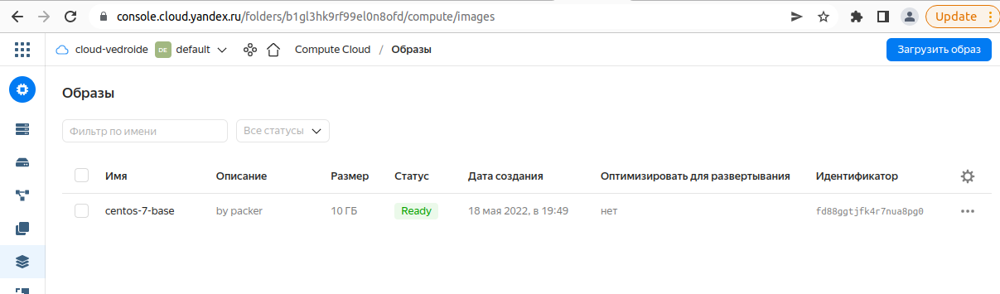

# Домашнее задание к занятию "5.4. Оркестрация группой Docker контейнеров на примере Docker Compose"

## Как сдавать задания

Обязательными к выполнению являются задачи без указания звездочки. Их выполнение необходимо для получения зачета и диплома о профессиональной переподготовке.

Задачи со звездочкой (*) являются дополнительными задачами и/или задачами повышенной сложности. Они не являются обязательными к выполнению, но помогут вам глубже понять тему.

Домашнее задание выполните в файле readme.md в github репозитории. В личном кабинете отправьте на проверку ссылку на .md-файл в вашем репозитории.

Любые вопросы по решению задач задавайте в чате учебной группы.

---

## Задача 1

Создать собственный образ операционной системы с помощью Packer.

Для получения зачета, вам необходимо предоставить:
- Скриншот страницы, как на слайде из презентации (слайд 37).

### Ответ:



листинг:
```
┌[vladimir☮ubuntu]-(~/devops-netology/05-virt-04-docker-compose)-[git://master ✗]-
└> packer build packer/centos-7-base.json
yandex: output will be in this color.

==> yandex: Creating temporary RSA SSH key for instance...
==> yandex: Using as source image: fd82tb3u07rkdkfte3dn (name: "centos-7-v20220518", family: "centos-7")
==> yandex: Use provided subnet id e2lohjpsc13s78bof69p
==> yandex: Creating disk...
==> yandex: Creating instance...
==> yandex: Waiting for instance with id epd6kp6ama614tcmsu0l to become active...
    yandex: Detected instance IP: 62.84.122.28
==> yandex: Using SSH communicator to connect: 62.84.122.28
==> yandex: Waiting for SSH to become available...
==> yandex: Connected to SSH!
==> yandex: Provisioning with shell script: /tmp/packer-shell1531803636
    yandex: Loaded plugins: fastestmirror
    yandex: Determining fastest mirrors
    yandex:  * base: mirror.yandex.ru
    yandex:  * extras: centos-mirror.rbc.ru
    yandex:  * updates: mirror.yandex.ru
==> yandex: http://mirrors.datahouse.ru/centos/7.9.2009/os/x86_64/repodata/repomd.xml: [Errno 14] curl#56 - "Recv failure: Connection reset by peer"
==> yandex: Trying other mirror.
==> yandex: http://mirrors.datahouse.ru/centos/7.9.2009/extras/x86_64/repodata/repomd.xml: [Errno 14] curl#56 - "Recv failure: Connection reset by peer"
==> yandex: Trying other mirror.
==> yandex: http://mirrors.datahouse.ru/centos/7.9.2009/updates/x86_64/repodata/repomd.xml: [Errno 14] curl#56 - "Recv failure: Connection reset by peer"
==> yandex: Trying other mirror.
==> yandex: http://mirrors.datahouse.ru/centos/7.9.2009/updates/x86_64/repodata/eed11291951411941c82a2218e1bb0157c7c90872c0d7aa508da56f9b4954765-primary.sqlite.bz2: [Errno 14] curl#56 - "Recv failure: Connection reset by peer"
==> yandex: Trying other mirror.
==> yandex: http://mirrors.datahouse.ru/centos/7.9.2009/extras/x86_64/repodata/5a11730873fb1d43f59e6456cdba2698c5de60b093aa9868c0ee8d8edf6a709d-primary.sqlite.bz2: [Errno 14] curl#56 - "Recv failure: Connection reset by peer"
==> yandex: Trying other mirror.
    yandex: Resolving Dependencies
    yandex: --> Running transaction check
    yandex: ---> Package expat.x86_64 0:2.1.0-12.el7 will be updated
    yandex: ---> Package expat.x86_64 0:2.1.0-14.el7_9 will be an update
    yandex: ---> Package gzip.x86_64 0:1.5-10.el7 will be updated
    yandex: ---> Package gzip.x86_64 0:1.5-11.el7_9 will be an update
    yandex: ---> Package kernel.x86_64 0:3.10.0-1160.62.1.el7 will be installed
    yandex: ---> Package kernel-tools.x86_64 0:3.10.0-1160.59.1.el7 will be updated
    yandex: ---> Package kernel-tools.x86_64 0:3.10.0-1160.62.1.el7 will be an update
    yandex: ---> Package kernel-tools-libs.x86_64 0:3.10.0-1160.59.1.el7 will be updated
    yandex: ---> Package kernel-tools-libs.x86_64 0:3.10.0-1160.62.1.el7 will be an update
    yandex: ---> Package microcode_ctl.x86_64 2:2.1-73.11.el7_9 will be updated
    yandex: ---> Package microcode_ctl.x86_64 2:2.1-73.13.el7_9 will be an update
    yandex: ---> Package openssl.x86_64 1:1.0.2k-24.el7_9 will be updated
    yandex: ---> Package openssl.x86_64 1:1.0.2k-25.el7_9 will be an update
    yandex: ---> Package openssl-libs.x86_64 1:1.0.2k-24.el7_9 will be updated
    yandex: ---> Package openssl-libs.x86_64 1:1.0.2k-25.el7_9 will be an update
    yandex: ---> Package python-perf.x86_64 0:3.10.0-1160.59.1.el7 will be updated
    yandex: ---> Package python-perf.x86_64 0:3.10.0-1160.62.1.el7 will be an update
    yandex: ---> Package rsyslog.x86_64 0:8.24.0-57.el7_9.1 will be updated
    yandex: ---> Package rsyslog.x86_64 0:8.24.0-57.el7_9.2 will be an update
    yandex: ---> Package tzdata.noarch 0:2021e-1.el7 will be updated
    yandex: ---> Package tzdata.noarch 0:2022a-1.el7 will be an update
    yandex: ---> Package zlib.x86_64 0:1.2.7-19.el7_9 will be updated
    yandex: ---> Package zlib.x86_64 0:1.2.7-20.el7_9 will be an update
    yandex: --> Finished Dependency Resolution
    yandex:
    yandex: Dependencies Resolved
    yandex:
    yandex: ================================================================================
    yandex:  Package               Arch       Version                     Repository   Size
    yandex: ================================================================================
    yandex: Installing:
    yandex:  kernel                x86_64     3.10.0-1160.62.1.el7        updates      50 M
    yandex: Updating:
    yandex:  expat                 x86_64     2.1.0-14.el7_9              updates      83 k
    yandex:  gzip                  x86_64     1.5-11.el7_9                updates     130 k
    yandex:  kernel-tools          x86_64     3.10.0-1160.62.1.el7        updates     8.2 M
    yandex:  kernel-tools-libs     x86_64     3.10.0-1160.62.1.el7        updates     8.1 M
    yandex:  microcode_ctl         x86_64     2:2.1-73.13.el7_9           updates     4.2 M
    yandex:  openssl               x86_64     1:1.0.2k-25.el7_9           updates     494 k
    yandex:  openssl-libs          x86_64     1:1.0.2k-25.el7_9           updates     1.2 M
    yandex:  python-perf           x86_64     3.10.0-1160.62.1.el7        updates     8.2 M
    yandex:  rsyslog               x86_64     8.24.0-57.el7_9.2           updates     622 k
    yandex:  tzdata                noarch     2022a-1.el7                 updates     501 k
    yandex:  zlib                  x86_64     1.2.7-20.el7_9              updates      90 k
    yandex:
    yandex: Transaction Summary
    yandex: ================================================================================
    yandex: Install   1 Package
    yandex: Upgrade  11 Packages
    yandex:
    yandex: Total download size: 82 M
    yandex: Downloading packages:
    yandex: Delta RPMs disabled because /usr/bin/applydeltarpm not installed.
    yandex: --------------------------------------------------------------------------------
    yandex: Total                                               70 MB/s |  82 MB  00:01
    yandex: Running transaction check
    yandex: Running transaction test
    yandex: Transaction test succeeded
    yandex: Running transaction
    yandex:   Updating   : zlib-1.2.7-20.el7_9.x86_64                                  1/23
    yandex:   Updating   : 1:openssl-libs-1.0.2k-25.el7_9.x86_64                       2/23
    yandex:   Updating   : kernel-tools-libs-3.10.0-1160.62.1.el7.x86_64               3/23
    yandex:   Updating   : kernel-tools-3.10.0-1160.62.1.el7.x86_64                    4/23
    yandex:   Updating   : 1:openssl-1.0.2k-25.el7_9.x86_64                            5/23
    yandex:   Updating   : rsyslog-8.24.0-57.el7_9.2.x86_64                            6/23
    yandex:   Installing : kernel-3.10.0-1160.62.1.el7.x86_64                          7/23
    yandex:   Updating   : gzip-1.5-11.el7_9.x86_64                                    8/23
    yandex:   Updating   : tzdata-2022a-1.el7.noarch                                   9/23
    yandex:   Updating   : python-perf-3.10.0-1160.62.1.el7.x86_64                    10/23
    yandex:   Updating   : expat-2.1.0-14.el7_9.x86_64                                11/23
    yandex:   Updating   : 2:microcode_ctl-2.1-73.13.el7_9.x86_64                     12/23
    yandex:   Cleanup    : 1:openssl-1.0.2k-24.el7_9.x86_64                           13/23
    yandex:   Cleanup    : 1:openssl-libs-1.0.2k-24.el7_9.x86_64                      14/23
    yandex:   Cleanup    : kernel-tools-3.10.0-1160.59.1.el7.x86_64                   15/23
    yandex:   Cleanup    : rsyslog-8.24.0-57.el7_9.1.x86_64                           16/23
    yandex:   Cleanup    : tzdata-2021e-1.el7.noarch                                  17/23
    yandex:   Cleanup    : 2:microcode_ctl-2.1-73.11.el7_9.x86_64                     18/23
    yandex:   Cleanup    : zlib-1.2.7-19.el7_9.x86_64                                 19/23
    yandex:   Cleanup    : kernel-tools-libs-3.10.0-1160.59.1.el7.x86_64              20/23
    yandex:   Cleanup    : gzip-1.5-10.el7.x86_64                                     21/23
    yandex:   Cleanup    : python-perf-3.10.0-1160.59.1.el7.x86_64                    22/23
    yandex:   Cleanup    : expat-2.1.0-12.el7.x86_64                                  23/23
    yandex:   Verifying  : kernel-tools-libs-3.10.0-1160.62.1.el7.x86_64               1/23
    yandex:   Verifying  : 1:openssl-1.0.2k-25.el7_9.x86_64                            2/23
    yandex:   Verifying  : rsyslog-8.24.0-57.el7_9.2.x86_64                            3/23
    yandex:   Verifying  : 2:microcode_ctl-2.1-73.13.el7_9.x86_64                      4/23
    yandex:   Verifying  : expat-2.1.0-14.el7_9.x86_64                                 5/23
    yandex:   Verifying  : kernel-tools-3.10.0-1160.62.1.el7.x86_64                    6/23
    yandex:   Verifying  : python-perf-3.10.0-1160.62.1.el7.x86_64                     7/23
    yandex:   Verifying  : 1:openssl-libs-1.0.2k-25.el7_9.x86_64                       8/23
    yandex:   Verifying  : zlib-1.2.7-20.el7_9.x86_64                                  9/23
    yandex:   Verifying  : tzdata-2022a-1.el7.noarch                                  10/23
    yandex:   Verifying  : gzip-1.5-11.el7_9.x86_64                                   11/23
    yandex:   Verifying  : kernel-3.10.0-1160.62.1.el7.x86_64                         12/23
    yandex:   Verifying  : expat-2.1.0-12.el7.x86_64                                  13/23
    yandex:   Verifying  : zlib-1.2.7-19.el7_9.x86_64                                 14/23
    yandex:   Verifying  : gzip-1.5-10.el7.x86_64                                     15/23
    yandex:   Verifying  : tzdata-2021e-1.el7.noarch                                  16/23
    yandex:   Verifying  : 1:openssl-libs-1.0.2k-24.el7_9.x86_64                      17/23
    yandex:   Verifying  : kernel-tools-3.10.0-1160.59.1.el7.x86_64                   18/23
    yandex:   Verifying  : 1:openssl-1.0.2k-24.el7_9.x86_64                           19/23
    yandex:   Verifying  : 2:microcode_ctl-2.1-73.11.el7_9.x86_64                     20/23
    yandex:   Verifying  : kernel-tools-libs-3.10.0-1160.59.1.el7.x86_64              21/23
    yandex:   Verifying  : rsyslog-8.24.0-57.el7_9.1.x86_64                           22/23
    yandex:   Verifying  : python-perf-3.10.0-1160.59.1.el7.x86_64                    23/23
    yandex:
    yandex: Installed:
    yandex:   kernel.x86_64 0:3.10.0-1160.62.1.el7
    yandex:
    yandex: Updated:
    yandex:   expat.x86_64 0:2.1.0-14.el7_9
    yandex:   gzip.x86_64 0:1.5-11.el7_9
    yandex:   kernel-tools.x86_64 0:3.10.0-1160.62.1.el7
    yandex:   kernel-tools-libs.x86_64 0:3.10.0-1160.62.1.el7
    yandex:   microcode_ctl.x86_64 2:2.1-73.13.el7_9
    yandex:   openssl.x86_64 1:1.0.2k-25.el7_9
    yandex:   openssl-libs.x86_64 1:1.0.2k-25.el7_9
    yandex:   python-perf.x86_64 0:3.10.0-1160.62.1.el7
    yandex:   rsyslog.x86_64 0:8.24.0-57.el7_9.2
    yandex:   tzdata.noarch 0:2022a-1.el7
    yandex:   zlib.x86_64 0:1.2.7-20.el7_9
    yandex:
    yandex: Complete!
    yandex: Loaded plugins: fastestmirror
    yandex: Loading mirror speeds from cached hostfile
    yandex:  * base: mirror.yandex.ru
    yandex:  * extras: centos-mirror.rbc.ru
    yandex:  * updates: mirror.yandex.ru
    yandex: Package iptables-1.4.21-35.el7.x86_64 already installed and latest version
    yandex: Package curl-7.29.0-59.el7_9.1.x86_64 already installed and latest version
    yandex: Package net-tools-2.0-0.25.20131004git.el7.x86_64 already installed and latest version
    yandex: Package rsync-3.1.2-10.el7.x86_64 already installed and latest version
    yandex: Package openssh-server-7.4p1-22.el7_9.x86_64 already installed and latest version
    yandex: Resolving Dependencies
    yandex: --> Running transaction check
    yandex: ---> Package bind-utils.x86_64 32:9.11.4-26.P2.el7_9.9 will be installed
    yandex: --> Processing Dependency: bind-libs-lite(x86-64) = 32:9.11.4-26.P2.el7_9.9 for package: 32:bind-utils-9.11.4-26.P2.el7_9.9.x86_64
    yandex: --> Processing Dependency: bind-libs(x86-64) = 32:9.11.4-26.P2.el7_9.9 for package: 32:bind-utils-9.11.4-26.P2.el7_9.9.x86_64
    yandex: --> Processing Dependency: liblwres.so.160()(64bit) for package: 32:bind-utils-9.11.4-26.P2.el7_9.9.x86_64
    yandex: --> Processing Dependency: libisccfg.so.160()(64bit) for package: 32:bind-utils-9.11.4-26.P2.el7_9.9.x86_64
    yandex: --> Processing Dependency: libisc.so.169()(64bit) for package: 32:bind-utils-9.11.4-26.P2.el7_9.9.x86_64
    yandex: --> Processing Dependency: libirs.so.160()(64bit) for package: 32:bind-utils-9.11.4-26.P2.el7_9.9.x86_64
    yandex: --> Processing Dependency: libdns.so.1102()(64bit) for package: 32:bind-utils-9.11.4-26.P2.el7_9.9.x86_64
    yandex: --> Processing Dependency: libbind9.so.160()(64bit) for package: 32:bind-utils-9.11.4-26.P2.el7_9.9.x86_64
    yandex: --> Processing Dependency: libGeoIP.so.1()(64bit) for package: 32:bind-utils-9.11.4-26.P2.el7_9.9.x86_64
    yandex: ---> Package bridge-utils.x86_64 0:1.5-9.el7 will be installed
    yandex: ---> Package tcpdump.x86_64 14:4.9.2-4.el7_7.1 will be installed
    yandex: --> Processing Dependency: libpcap >= 14:1.5.3-10 for package: 14:tcpdump-4.9.2-4.el7_7.1.x86_64
    yandex: --> Processing Dependency: libpcap.so.1()(64bit) for package: 14:tcpdump-4.9.2-4.el7_7.1.x86_64
    yandex: ---> Package telnet.x86_64 1:0.17-66.el7 will be installed
    yandex: --> Running transaction check
    yandex: ---> Package GeoIP.x86_64 0:1.5.0-14.el7 will be installed
    yandex: --> Processing Dependency: geoipupdate for package: GeoIP-1.5.0-14.el7.x86_64
    yandex: ---> Package bind-libs.x86_64 32:9.11.4-26.P2.el7_9.9 will be installed
    yandex: --> Processing Dependency: bind-license = 32:9.11.4-26.P2.el7_9.9 for package: 32:bind-libs-9.11.4-26.P2.el7_9.9.x86_64
    yandex: ---> Package bind-libs-lite.x86_64 32:9.11.4-26.P2.el7_9.9 will be installed
    yandex: ---> Package libpcap.x86_64 14:1.5.3-13.el7_9 will be installed
    yandex: --> Running transaction check
    yandex: ---> Package bind-license.noarch 32:9.11.4-26.P2.el7_9.9 will be installed
    yandex: ---> Package geoipupdate.x86_64 0:2.5.0-1.el7 will be installed
    yandex: --> Finished Dependency Resolution
    yandex:
    yandex: Dependencies Resolved
    yandex:
    yandex: ================================================================================
    yandex:  Package            Arch       Version                        Repository   Size
    yandex: ================================================================================
    yandex: Installing:
    yandex:  bind-utils         x86_64     32:9.11.4-26.P2.el7_9.9        updates     261 k
    yandex:  bridge-utils       x86_64     1.5-9.el7                      base         32 k
    yandex:  tcpdump            x86_64     14:4.9.2-4.el7_7.1             base        422 k
    yandex:  telnet             x86_64     1:0.17-66.el7                  updates      64 k
    yandex: Installing for dependencies:
    yandex:  GeoIP              x86_64     1.5.0-14.el7                   base        1.5 M
    yandex:  bind-libs          x86_64     32:9.11.4-26.P2.el7_9.9        updates     157 k
    yandex:  bind-libs-lite     x86_64     32:9.11.4-26.P2.el7_9.9        updates     1.1 M
    yandex:  bind-license       noarch     32:9.11.4-26.P2.el7_9.9        updates      91 k
    yandex:  geoipupdate        x86_64     2.5.0-1.el7                    base         35 k
    yandex:  libpcap            x86_64     14:1.5.3-13.el7_9              updates     139 k
    yandex:
    yandex: Transaction Summary
    yandex: ================================================================================
    yandex: Install  4 Packages (+6 Dependent packages)
    yandex:
    yandex: Total download size: 3.8 M
    yandex: Installed size: 9.0 M
    yandex: Downloading packages:
    yandex: --------------------------------------------------------------------------------
    yandex: Total                                               12 MB/s | 3.8 MB  00:00
    yandex: Running transaction check
    yandex: Running transaction test
    yandex: Transaction test succeeded
    yandex: Running transaction
    yandex:   Installing : 32:bind-license-9.11.4-26.P2.el7_9.9.noarch                 1/10
    yandex:   Installing : geoipupdate-2.5.0-1.el7.x86_64                              2/10
    yandex:   Installing : GeoIP-1.5.0-14.el7.x86_64                                   3/10
    yandex:   Installing : 32:bind-libs-lite-9.11.4-26.P2.el7_9.9.x86_64               4/10
    yandex:   Installing : 32:bind-libs-9.11.4-26.P2.el7_9.9.x86_64                    5/10
    yandex:   Installing : 14:libpcap-1.5.3-13.el7_9.x86_64                            6/10
    yandex: pam_tally2: Error opening /var/log/tallylog for update: Permission denied
    yandex: pam_tally2: Authentication error
    yandex: useradd: failed to reset the tallylog entry of user "tcpdump"
    yandex:   Installing : 14:tcpdump-4.9.2-4.el7_7.1.x86_64                           7/10
    yandex:   Installing : 32:bind-utils-9.11.4-26.P2.el7_9.9.x86_64                   8/10
    yandex:   Installing : bridge-utils-1.5-9.el7.x86_64                               9/10
    yandex:   Installing : 1:telnet-0.17-66.el7.x86_64                                10/10
    yandex:   Verifying  : GeoIP-1.5.0-14.el7.x86_64                                   1/10
    yandex:   Verifying  : 14:libpcap-1.5.3-13.el7_9.x86_64                            2/10
    yandex:   Verifying  : 1:telnet-0.17-66.el7.x86_64                                 3/10
    yandex:   Verifying  : 32:bind-libs-9.11.4-26.P2.el7_9.9.x86_64                    4/10
    yandex:   Verifying  : geoipupdate-2.5.0-1.el7.x86_64                              5/10
    yandex:   Verifying  : 14:tcpdump-4.9.2-4.el7_7.1.x86_64                           6/10
    yandex:   Verifying  : 32:bind-license-9.11.4-26.P2.el7_9.9.noarch                 7/10
    yandex:   Verifying  : bridge-utils-1.5-9.el7.x86_64                               8/10
    yandex:   Verifying  : 32:bind-libs-lite-9.11.4-26.P2.el7_9.9.x86_64               9/10
    yandex:   Verifying  : 32:bind-utils-9.11.4-26.P2.el7_9.9.x86_64                  10/10
    yandex:
    yandex: Installed:
    yandex:   bind-utils.x86_64 32:9.11.4-26.P2.el7_9.9   bridge-utils.x86_64 0:1.5-9.el7
    yandex:   tcpdump.x86_64 14:4.9.2-4.el7_7.1           telnet.x86_64 1:0.17-66.el7
    yandex:
    yandex: Dependency Installed:
    yandex:   GeoIP.x86_64 0:1.5.0-14.el7
    yandex:   bind-libs.x86_64 32:9.11.4-26.P2.el7_9.9
    yandex:   bind-libs-lite.x86_64 32:9.11.4-26.P2.el7_9.9
    yandex:   bind-license.noarch 32:9.11.4-26.P2.el7_9.9
    yandex:   geoipupdate.x86_64 0:2.5.0-1.el7
    yandex:   libpcap.x86_64 14:1.5.3-13.el7_9
    yandex:
    yandex: Complete!
==> yandex: Stopping instance...
==> yandex: Deleting instance...
    yandex: Instance has been deleted!
==> yandex: Creating image: centos-7-base
==> yandex: Waiting for image to complete...
==> yandex: Success image create...
==> yandex: Destroying boot disk...
    yandex: Disk has been deleted!
Build 'yandex' finished after 5 minutes 49 seconds.

==> Wait completed after 5 minutes 49 seconds

==> Builds finished. The artifacts of successful builds are:
--> yandex: A disk image was created: centos-7-base (id: fd88ggtjfk4r7nua8pg0) with family name centos
┌[vladimir☮ubuntu]-(~/devops-netology/05-virt-04-docker-compose)-[git://master ✗]-
└> yc compute image list
+----------------------+---------------+--------+----------------------+--------+
|          ID          |     NAME      | FAMILY |     PRODUCT IDS      | STATUS |
+----------------------+---------------+--------+----------------------+--------+
| fd88ggtjfk4r7nua8pg0 | centos-7-base | centos | f2esd9f5o5i9p7pkkk8k | READY  |
+----------------------+---------------+--------+----------------------+--------+
```
## Задача 2

Создать вашу первую виртуальную машину в Яндекс.Облаке.

Для получения зачета, вам необходимо предоставить:
- Скриншот страницы свойств созданной ВМ, как на примере ниже:

### Ответ


Листинг:
```
┌[vladimir☮ubuntu]-(~/devops-netology/05-virt-04-docker-compose/terraform)-[git://master ✗]-
└> terraform plan

Terraform used the selected providers to generate the following execution plan. Resource actions are indicated with the following symbols:
  + create

Terraform will perform the following actions:

  # yandex_compute_instance.node01 will be created
  + resource "yandex_compute_instance" "node01" {
      + allow_stopping_for_update = true
      + created_at                = (known after apply)
      + folder_id                 = (known after apply)
      + fqdn                      = (known after apply)
      + hostname                  = "node01.netology.cloud"
      + id                        = (known after apply)
      + metadata                  = {
          + "ssh-keys" = <<-EOT
                centos:ssh-ed25519 AAAAC3NzaC1lZDI1NTE5AAAAIMIwO680+vq7rFia8N9UkZhvdwTmfXTTC1QSK9Hni//j work-pc
            EOT
        }
      + name                      = "node01"
      + network_acceleration_type = "standard"
      + platform_id               = "standard-v1"
      + service_account_id        = (known after apply)
      + status                    = (known after apply)
      + zone                      = "ru-central1-b"

      + boot_disk {
          + auto_delete = true
          + device_name = (known after apply)
          + disk_id     = (known after apply)
          + mode        = (known after apply)

          + initialize_params {
              + block_size  = (known after apply)
              + description = (known after apply)
              + image_id    = "fd88ggtjfk4r7nua8pg0"
              + name        = "root-node01"
              + size        = 50
              + snapshot_id = (known after apply)
              + type        = "network-nvme"
            }
        }

      + network_interface {
          + index              = (known after apply)
          + ip_address         = (known after apply)
          + ipv4               = true
          + ipv6               = (known after apply)
          + ipv6_address       = (known after apply)
          + mac_address        = (known after apply)
          + nat                = true
          + nat_ip_address     = (known after apply)
          + nat_ip_version     = (known after apply)
          + security_group_ids = (known after apply)
          + subnet_id          = (known after apply)
        }

      + placement_policy {
          + host_affinity_rules = (known after apply)
          + placement_group_id  = (known after apply)
        }

      + resources {
          + core_fraction = 100
          + cores         = 8
          + memory        = 8
        }

      + scheduling_policy {
          + preemptible = (known after apply)
        }
    }

  # yandex_vpc_network.default will be created
  + resource "yandex_vpc_network" "default" {
      + created_at                = (known after apply)
      + default_security_group_id = (known after apply)
      + folder_id                 = (known after apply)
      + id                        = (known after apply)
      + labels                    = (known after apply)
      + name                      = "net"
      + subnet_ids                = (known after apply)
    }

  # yandex_vpc_subnet.default will be created
  + resource "yandex_vpc_subnet" "default" {
      + created_at     = (known after apply)
      + folder_id      = (known after apply)
      + id             = (known after apply)
      + labels         = (known after apply)
      + name           = "subnet"
      + network_id     = (known after apply)
      + v4_cidr_blocks = [
          + "192.168.101.0/24",
        ]
      + v6_cidr_blocks = (known after apply)
      + zone           = "ru-central1-b"
    }

Plan: 3 to add, 0 to change, 0 to destroy.

Changes to Outputs:
  + external_ip_address_node01_yandex_cloud = (known after apply)
  + internal_ip_address_node01_yandex_cloud = (known after apply)

────────────────────────────────────────────────────────────────────────────────────────────────────────────────────────────────────────────────────────────────────────────────────────────────────────────────────────────────────────────────────────────────────────────────────────

Note: You didn't use the -out option to save this plan, so Terraform can't guarantee to take exactly these actions if you run "terraform apply" now.
┌[vladimir☮ubuntu]-(~/devops-netology/05-virt-04-docker-compose/terraform)-[git://master ✗]-
└> terraform apply                                                            

Terraform used the selected providers to generate the following execution plan. Resource actions are indicated with the following symbols:
  + create

Terraform will perform the following actions:

  # yandex_compute_instance.node01 will be created
  + resource "yandex_compute_instance" "node01" {
      + allow_stopping_for_update = true
      + created_at                = (known after apply)
      + folder_id                 = (known after apply)
      + fqdn                      = (known after apply)
      + hostname                  = "node01.netology.cloud"
      + id                 ubuntu-minimal.json       = {
          + "ssh-keys" = <<-EOT
                centos:ssh-ed25519 AAAAC3NzaC1lZDI1NTE5AAAAIMIwO680+vq7rFia8N9UkZhvdwTmfXTTC1QSK9Hni//j work-pc
            EOT
        }
      + name                      = "node01"
      + network_acceleration_type = "standard"
      + platform_id               = "standard-v1"
      + service_account_id        = (known after apply)
      + status                    = (known after apply)
      + zone                      = "ru-central1-b"

      + boot_disk {
          + auto_delete = true
          + device_name = (known after apply)
          + disk_id     = (known after apply)
          + mode        = (known after apply)

          + initialize_params {
              + block_size  = (known after apply)
              + description = (known after apply)
              + image_id    = "fd88ggtjfk4r7nua8pg0"
              + name        = "root-node01"
              + size        = 50
              + snapshot_id = (known after apply)
              + type        = "network-nvme"
            }
        }

      + network_interface {
          + index              = (known after apply)
          + ip_address         = (known after apply)
          + ipv4               = true
          + ipv6               = (known after apply)
          + ipv6_address       = (known after apply)
          + mac_address        = (known after apply)
          + nat                = true
          + nat_ip_address     = (known after apply)
          + nat_ip_version     = (known after apply)
          + security_group_ids = (known after apply)
          + subnet_id          = (known after apply)
        }

      + placement_policy {
          + host_affinity_rules = (known after apply)
          + placement_group_id  = (known after apply)
        }

      + resources {
          + core_fraction = 100
          + cores         = 8
          + memory        = 8
        }

      + scheduling_policy {
          + preemptible = (known after apply)
        }
    }

  # yandex_vpc_network.default will be created
  + resource "yandex_vpc_network" "default" {
      + created_at                = (known after apply)
      + default_security_group_id = (known after apply)
      + folder_id                 = (known after apply)
      + id                        = (known after apply)
      + labels                    = (known after apply)
      + name                      = "net"
      + subnet_ids                = (known after apply)
    }

  # yandex_vpc_subnet.default will be created
  + resource "yandex_vpc_subnet" "default" {
      + created_at     = (known after apply)
      + folder_id      = (known after apply)
      + id             = (known after apply)
      + labels         = (known after apply)
      + name           = "subnet"
      + network_id     = (known after apply)
      + v4_cidr_blocks = [
          + "192.168.101.0/24",
        ]
      + v6_cidr_blocks = (known after apply)
      + zone           = "ru-central1-b"
    }

Plan: 3 to add, 0 to change, 0 to destroy.

Changes to Outputs:
  + external_ip_address_node01_yandex_cloud = (known after apply)
  + internal_ip_address_node01_yandex_cloud = (known after apply)

Do you want to perform these actions?
  Terraform will perform the actions described above.
  Only 'yes' will be accepted to approve.

  Enter a value: yes

yandex_vpc_network.default: Creating...
yandex_vpc_network.default: Creation complete after 2s [id=enpv21q44c4tst71luss]
yandex_vpc_subnet.default: Creating...
yandex_vpc_subnet.default: Creation complete after 1s [id=e2ltg9v1s6ddh6k5no8t]
yandex_compute_instance.node01: Creating...
yandex_compute_instance.node01: Still creating... [10s elapsed]
yandex_compute_instance.node01: Still creating... [20s elapsed]
yandex_compute_instance.node01: Still creating... [30s elapsed]
yandex_compute_instance.node01: Creation complete after 33s [id=epdc40hta43b4mccb1uo]

Apply complete! Resources: 3 added, 0 changed, 0 destroyed.

Outputs:

external_ip_address_node01_yandex_cloud = "84.252.139.227"
internal_ip_address_node01_yandex_cloud = "192.168.101.20"
```

## Задача 3

Создать ваш первый готовый к боевой эксплуатации компонент мониторинга, состоящий из стека микросервисов.

Для получения зачета, вам необходимо предоставить:
- Скриншот работающего веб-интерфейса Grafana с текущими метриками, как на примере ниже

### Ответ


листинг:
```
┌[vladimir☮ubuntu]-(~/devops-netology/05-virt-04-docker-compose/terraform)-[git://master ✗]-
└> cd ../ansible 
┌[vladimir☮ubuntu]-(~/devops-netology/05-virt-04-docker-compose/ansible)-[git://master ✗]-
└> ansible-playbook provision.yml 

PLAY [nodes] ****************************************************************************************************************************************************************************************************************************************************************************

TASK [Gathering Facts] ******************************************************************************************************************************************************************************************************************************************************************
The authenticity of host '84.252.139.227 (84.252.139.227)' can't be established.
ECDSA key fingerprint is SHA256:0G4fttREZ6gETgPDJ7gV5zkIz6caXEuaPHxnmyrHS/o.
Are you sure you want to continue connecting (yes/no/[fingerprint])? yes
ok: [node01.netology.cloud]

TASK [Create directory for ssh-keys] ****************************************************************************************************************************************************************************************************************************************************
ok: [node01.netology.cloud]

TASK [Adding rsa-key in /root/.ssh/authorized_keys] *********************************************************************************************************************************************************************************************************************************************************************
changed: [node01.netology.cloud]

TASK [Checking DNS] *********************************************************************************************************************************************************************************************************************************************************************
changed: [node01.netology.cloud]

TASK [Installing tools] *****************************************************************************************************************************************************************************************************************************************************************
changed: [node01.netology.cloud]

TASK [Add docker repository] ************************************************************************************************************************************************************************************************************************************************************
changed: [node01.netology.cloud]

TASK [Installing docker package] ********************************************************************************************************************************************************************************************************************************************************
changed: [node01.netology.cloud] => (item=['docker-ce', 'docker-ce-cli', 'containerd.io'])

TASK [Enable docker daemon] *************************************************************************************************************************************************************************************************************************************************************
changed: [node01.netology.cloud]

TASK [Install docker-compose] ***********************************************************************************************************************************************************************************************************************************************************
changed: [node01.netology.cloud]

TASK [Synchronization] ******************************************************************************************************************************************************************************************************************************************************************
changed: [node01.netology.cloud]

TASK [Pull all images in compose] *******************************************************************************************************************************************************************************************************************************************************
changed: [node01.netology.cloud]

TASK [Up all services in compose] *******************************************************************************************************************************************************************************************************************************************************
changed: [node01.netology.cloud]

PLAY RECAP ******************************************************************************************************************************************************************************************************************************************************************************
node01.netology.cloud      : ok=12   changed=10    unreachable=0    failed=0    skipped=0    rescued=0    ignored=0   
```

## Задача 4 (*)

Создать вторую ВМ и подключить её к мониторингу развёрнутому на первом сервере.

Для получения зачета, вам необходимо предоставить:
- Скриншот из Grafana, на котором будут отображаться метрики добавленного вами сервера.
