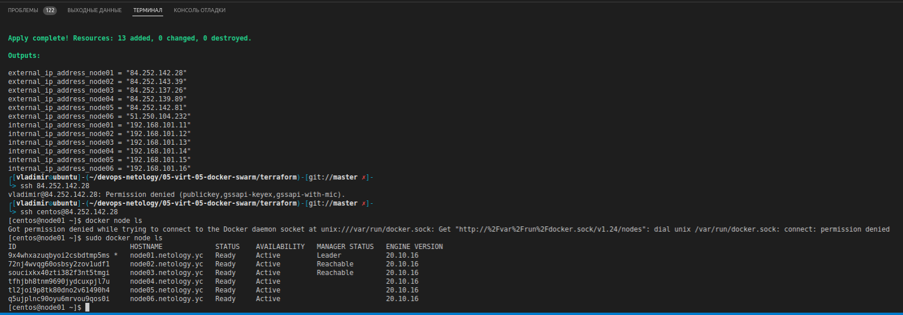
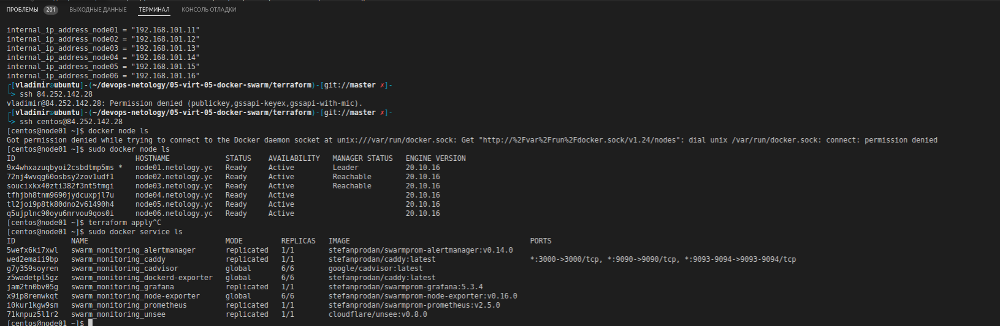

# Домашнее задание к занятию "5.5. Оркестрация кластером Docker контейнеров на примере Docker Swarm"

## Как сдавать задания

Обязательными к выполнению являются задачи без указания звездочки. Их выполнение необходимо для получения зачета и диплома о профессиональной переподготовке.

Задачи со звездочкой (*) являются дополнительными задачами и/или задачами повышенной сложности. Они не являются обязательными к выполнению, но помогут вам глубже понять тему.

Домашнее задание выполните в файле readme.md в github репозитории. В личном кабинете отправьте на проверку ссылку на .md-файл в вашем репозитории.

Любые вопросы по решению задач задавайте в чате учебной группы.

---

## Задача 1

Дайте письменые ответы на следующие вопросы:

- В чём отличие режимов работы сервисов в Docker Swarm кластере: replication и global?
- Какой алгоритм выбора лидера используется в Docker Swarm кластере?
- Что такое Overlay Network?

### Ответ

- В чём отличие режимов работы сервисов в Docker Swarm кластере: replication и global? replication запускает сервис на указанном в команде ```update --replicas=N```, а global на всех доступных.
- Какой алгоритм выбора лидера используется в Docker Swarm кластере? Raft - лидер нода получившая большее количество голосов.
- Что такое Overlay Network? распределенная вирт сеть для обмена данных между контейнерами.

## Задача 2

Создать ваш первый Docker Swarm кластер в Яндекс.Облаке

Для получения зачета, вам необходимо предоставить скриншот из терминала (консоли), с выводом команды:
```
docker node ls
```

### Ответ



Листинг команд:

```
┌[vladimir☮ubuntu]-(~/devops-netology/05-virt-05-docker-swarm/terraform)-[git://master ✗]-
└> terraform apply

Terraform used the selected providers to generate the following execution plan. Resource actions are indicated with the following symbols:
  + create

Terraform will perform the following actions:

  # local_file.inventory will be created
  + resource "local_file" "inventory" {
      + content              = (known after apply)
      + directory_permission = "0777"
      + file_permission      = "0777"
      + filename             = "../ansible/inventory"
      + id                   = (known after apply)
    }

  # null_resource.cluster will be created
  + resource "null_resource" "cluster" {
      + id = (known after apply)
    }

  # null_resource.monitoring will be created
  + resource "null_resource" "monitoring" {
      + id = (known after apply)
    }

  # null_resource.sync will be created
  + resource "null_resource" "sync" {
      + id = (known after apply)
    }

  # null_resource.wait will be created
  + resource "null_resource" "wait" {
      + id = (known after apply)
    }

  # yandex_compute_instance.node01 will be created
  + resource "yandex_compute_instance" "node01" {
      + allow_stopping_for_update = true
      + created_at                = (known after apply)
      + folder_id                 = (known after apply)
      + fqdn                      = (known after apply)
      + hostname                  = "node01.netology.yc"
      + id                        = (known after apply)
      + metadata                  = {
          + "ssh-keys" = <<-EOT
                centos:ssh-ed25519 AAAAC3NzaC1lZDI1NTE5AAAAIMIwO680+vq7rFia8N9UkZhvdwTmfXTTC1QSK9Hni//j work-pc
            EOT
        }
      + name                      = "node01"
      + network_acceleration_type = "standard"
      + platform_id               = "standard-v1"
      + service_account_id        = (known after apply)
      + status                    = (known after apply)
      + zone                      = "ru-central1-b"

      + boot_disk {
          + auto_delete = true
          + device_name = (known after apply)
          + disk_id     = (known after apply)
          + mode        = (known after apply)

          + initialize_params {
              + block_size  = (known after apply)
              + description = (known after apply)
              + image_id    = "fd83g7g8hv165dmrnain"
              + name        = "root-node01"
              + size        = 10
              + snapshot_id = (known after apply)
              + type        = "network-nvme"
            }
        }

      + network_interface {
          + index              = (known after apply)
          + ip_address         = "192.168.101.11"
          + ipv4               = true
          + ipv6               = (known after apply)
          + ipv6_address       = (known after apply)
          + mac_address        = (known after apply)
          + nat                = true
          + nat_ip_address     = (known after apply)
          + nat_ip_version     = (known after apply)
          + security_group_ids = (known after apply)
          + subnet_id          = (known after apply)
        }

      + placement_policy {
          + host_affinity_rules = (known after apply)
          + placement_group_id  = (known after apply)
        }

      + resources {
          + core_fraction = 100
          + cores         = 4
          + memory        = 8
        }

      + scheduling_policy {
          + preemptible = (known after apply)
        }
    }

  # yandex_compute_instance.node02 will be created
  + resource "yandex_compute_instance" "node02" {
      + allow_stopping_for_update = true
      + created_at                = (known after apply)
      + folder_id                 = (known after apply)
      + fqdn                      = (known after apply)
      + hostname                  = "node02.netology.yc"
      + id                        = (known after apply)
      + metadata                  = {
          + "ssh-keys" = <<-EOT
                centos:ssh-ed25519 AAAAC3NzaC1lZDI1NTE5AAAAIMIwO680+vq7rFia8N9UkZhvdwTmfXTTC1QSK9Hni//j work-pc
            EOT
        }
      + name                      = "node02"
      + network_acceleration_type = "standard"
      + platform_id               = "standard-v1"
      + service_account_id        = (known after apply)
      + status                    = (known after apply)
      + zone                      = "ru-central1-b"

      + boot_disk {
          + auto_delete = true
          + device_name = (known after apply)
          + disk_id     = (known after apply)
          + mode        = (known after apply)

          + initialize_params {
              + block_size  = (known after apply)
              + description = (known after apply)
              + image_id    = "fd83g7g8hv165dmrnain"
              + name        = "root-node02"
              + size        = 10
              + snapshot_id = (known after apply)
              + type        = "network-nvme"
            }
        }

      + network_interface {
          + index              = (known after apply)
          + ip_address         = "192.168.101.12"
          + ipv4               = true
          + ipv6               = (known after apply)
          + ipv6_address       = (known after apply)
          + mac_address        = (known after apply)
          + nat                = true
          + nat_ip_address     = (known after apply)
          + nat_ip_version     = (known after apply)
          + security_group_ids = (known after apply)
          + subnet_id          = (known after apply)
        }

      + placement_policy {
          + host_affinity_rules = (known after apply)
          + placement_group_id  = (known after apply)
        }

      + resources {
          + core_fraction = 100
          + cores         = 4
          + memory        = 8
        }

      + scheduling_policy {
          + preemptible = (known after apply)
        }
    }

  # yandex_compute_instance.node03 will be created
  + resource "yandex_compute_instance" "node03" {
      + allow_stopping_for_update = true
      + created_at                = (known after apply)
      + folder_id                 = (known after apply)
      + fqdn                      = (known after apply)
      + hostname                  = "node03.netology.yc"
      + id                        = (known after apply)
      + metadata                  = {
          + "ssh-keys" = <<-EOT
                centos:ssh-ed25519 AAAAC3NzaC1lZDI1NTE5AAAAIMIwO680+vq7rFia8N9UkZhvdwTmfXTTC1QSK9Hni//j work-pc
            EOT
        }
      + name                      = "node03"
      + network_acceleration_type = "standard"
      + platform_id               = "standard-v1"
      + service_account_id        = (known after apply)
      + status                    = (known after apply)
      + zone                      = "ru-central1-b"

      + boot_disk {
          + auto_delete = true
          + device_name = (known after apply)
          + disk_id     = (known after apply)
          + mode        = (known after apply)

          + initialize_params {
              + block_size  = (known after apply)
              + description = (known after apply)
              + image_id    = "fd83g7g8hv165dmrnain"
              + name        = "root-node03"
              + size        = 10
              + snapshot_id = (known after apply)
              + type        = "network-nvme"
            }
        }

      + network_interface {
          + index              = (known after apply)
          + ip_address         = "192.168.101.13"
          + ipv4               = true
          + ipv6               = (known after apply)
          + ipv6_address       = (known after apply)
          + mac_address        = (known after apply)
          + nat                = true
          + nat_ip_address     = (known after apply)
          + nat_ip_version     = (known after apply)
          + security_group_ids = (known after apply)
          + subnet_id          = (known after apply)
        }

      + placement_policy {
          + host_affinity_rules = (known after apply)
          + placement_group_id  = (known after apply)
        }

      + resources {
          + core_fraction = 100
          + cores         = 4
          + memory        = 8
        }

      + scheduling_policy {
          + preemptible = (known after apply)
        }
    }

  # yandex_compute_instance.node04 will be created
  + resource "yandex_compute_instance" "node04" {
      + allow_stopping_for_update = true
      + created_at                = (known after apply)
      + folder_id                 = (known after apply)
      + fqdn                      = (known after apply)
      + hostname                  = "node04.netology.yc"
      + id                        = (known after apply)
      + metadata                  = {
          + "ssh-keys" = <<-EOT
                centos:ssh-ed25519 AAAAC3NzaC1lZDI1NTE5AAAAIMIwO680+vq7rFia8N9UkZhvdwTmfXTTC1QSK9Hni//j work-pc
            EOT
        }
      + name                      = "node04"
      + network_acceleration_type = "standard"
      + platform_id               = "standard-v1"
      + service_account_id        = (known after apply)
      + status                    = (known after apply)
      + zone                      = "ru-central1-b"

      + boot_disk {
          + auto_delete = true
          + device_name = (known after apply)
          + disk_id     = (known after apply)
          + mode        = (known after apply)

          + initialize_params {
              + block_size  = (known after apply)
              + description = (known after apply)
              + image_id    = "fd83g7g8hv165dmrnain"
              + name        = "root-node04"
              + size        = 40
              + snapshot_id = (known after apply)
              + type        = "network-nvme"
            }
        }

      + network_interface {
          + index              = (known after apply)
          + ip_address         = "192.168.101.14"
          + ipv4               = true
          + ipv6               = (known after apply)
          + ipv6_address       = (known after apply)
          + mac_address        = (known after apply)
          + nat                = true
          + nat_ip_address     = (known after apply)
          + nat_ip_version     = (known after apply)
          + security_group_ids = (known after apply)
          + subnet_id          = (known after apply)
        }

      + placement_policy {
          + host_affinity_rules = (known after apply)
          + placement_group_id  = (known after apply)
        }

      + resources {
          + core_fraction = 100
          + cores         = 4
          + memory        = 8
        }

      + scheduling_policy {
          + preemptible = (known after apply)
        }
    }

  # yandex_compute_instance.node05 will be created
  + resource "yandex_compute_instance" "node05" {
      + allow_stopping_for_update = true
      + created_at                = (known after apply)
      + folder_id                 = (known after apply)
      + fqdn                      = (known after apply)
      + hostname                  = "node05.netology.yc"
      + id                        = (known after apply)
      + metadata                  = {
          + "ssh-keys" = <<-EOT
                centos:ssh-ed25519 AAAAC3NzaC1lZDI1NTE5AAAAIMIwO680+vq7rFia8N9UkZhvdwTmfXTTC1QSK9Hni//j work-pc
            EOT
        }
      + name                      = "node05"
      + network_acceleration_type = "standard"
      + platform_id               = "standard-v1"
      + service_account_id        = (known after apply)
      + status                    = (known after apply)
      + zone                      = "ru-central1-b"

      + boot_disk {
          + auto_delete = true
          + device_name = (known after apply)
          + disk_id     = (known after apply)
          + mode        = (known after apply)

          + initialize_params {
              + block_size  = (known after apply)
              + description = (known after apply)
              + image_id    = "fd83g7g8hv165dmrnain"
              + name        = "root-node05"
              + size        = 40
              + snapshot_id = (known after apply)
              + type        = "network-nvme"
            }
        }

      + network_interface {
          + index              = (known after apply)
          + ip_address         = "192.168.101.15"
          + ipv4               = true
          + ipv6               = (known after apply)
          + ipv6_address       = (known after apply)
          + mac_address        = (known after apply)
          + nat                = true
          + nat_ip_address     = (known after apply)
          + nat_ip_version     = (known after apply)
          + security_group_ids = (known after apply)
          + subnet_id          = (known after apply)
        }

      + placement_policy {
          + host_affinity_rules = (known after apply)
          + placement_group_id  = (known after apply)
        }

      + resources {
          + core_fraction = 100
          + cores         = 4
          + memory        = 8
        }

      + scheduling_policy {
          + preemptible = (known after apply)
        }
    }

  # yandex_compute_instance.node06 will be created
  + resource "yandex_compute_instance" "node06" {
      + allow_stopping_for_update = true
      + created_at                = (known after apply)
      + folder_id                 = (known after apply)
      + fqdn                      = (known after apply)
      + hostname                  = "node06.netology.yc"
      + id                        = (known after apply)
      + metadata                  = {
          + "ssh-keys" = <<-EOT
                centos:ssh-ed25519 AAAAC3NzaC1lZDI1NTE5AAAAIMIwO680+vq7rFia8N9UkZhvdwTmfXTTC1QSK9Hni//j work-pc
            EOT
        }
      + name                      = "node06"
      + network_acceleration_type = "standard"
      + platform_id               = "standard-v1"
      + service_account_id        = (known after apply)
      + status                    = (known after apply)
      + zone                      = "ru-central1-b"

      + boot_disk {
          + auto_delete = true
          + device_name = (known after apply)
          + disk_id     = (known after apply)
          + mode        = (known after apply)

          + initialize_params {
              + block_size  = (known after apply)
              + description = (known after apply)
              + image_id    = "fd83g7g8hv165dmrnain"
              + name        = "root-node06"
              + size        = 40
              + snapshot_id = (known after apply)
              + type        = "network-nvme"
            }
        }

      + network_interface {
          + index              = (known after apply)
          + ip_address         = "192.168.101.16"
          + ipv4               = true
          + ipv6               = (known after apply)
          + ipv6_address       = (known after apply)
          + mac_address        = (known after apply)
          + nat                = true
          + nat_ip_address     = (known after apply)
          + nat_ip_version     = (known after apply)
          + security_group_ids = (known after apply)
          + subnet_id          = (known after apply)
        }

      + placement_policy {
          + host_affinity_rules = (known after apply)
          + placement_group_id  = (known after apply)
        }

      + resources {
          + core_fraction = 100
          + cores         = 4
          + memory        = 8
        }

      + scheduling_policy {
          + preemptible = (known after apply)
        }
    }

  # yandex_vpc_network.default will be created
  + resource "yandex_vpc_network" "default" {
      + created_at                = (known after apply)
      + default_security_group_id = (known after apply)
      + folder_id                 = (known after apply)
      + id                        = (known after apply)
      + labels                    = (known after apply)
      + name                      = "net"
      + subnet_ids                = (known after apply)
    }

  # yandex_vpc_subnet.default will be created
  + resource "yandex_vpc_subnet" "default" {
      + created_at     = (known after apply)
      + folder_id      = (known after apply)
      + id             = (known after apply)
      + labels         = (known after apply)
      + name           = "subnet"
      + network_id     = (known after apply)
      + v4_cidr_blocks = [
          + "192.168.101.0/24",
        ]
      + v6_cidr_blocks = (known after apply)
      + zone           = "ru-central1-b"
    }

Plan: 13 to add, 0 to change, 0 to destroy.

Changes to Outputs:
  + external_ip_address_node01 = (known after apply)
  + external_ip_address_node02 = (known after apply)
  + external_ip_address_node03 = (known after apply)
  + external_ip_address_node04 = (known after apply)
  + external_ip_address_node05 = (known after apply)
  + external_ip_address_node06 = (known after apply)

Do you want to perform these actions?
  Terraform will perform the actions described above.
  Only 'yes' will be accepted to approve.

  Enter a value: yes

yandex_vpc_network.default: Creating...
yandex_vpc_network.default: Creation complete after 1s [id=enpbcuqjeqvulaqbeeku]
yandex_vpc_subnet.default: Creating...
yandex_vpc_subnet.default: Creation complete after 0s [id=e2l3cehr00qn5r5nosrp]
yandex_compute_instance.node06: Creating...
yandex_compute_instance.node03: Creating...
yandex_compute_instance.node04: Creating...
yandex_compute_instance.node01: Creating...
yandex_compute_instance.node02: Creating...
yandex_compute_instance.node05: Creating...
yandex_compute_instance.node03: Still creating... [10s elapsed]
yandex_compute_instance.node02: Still creating... [10s elapsed]
yandex_compute_instance.node01: Still creating... [10s elapsed]
yandex_compute_instance.node04: Still creating... [10s elapsed]
yandex_compute_instance.node06: Still creating... [10s elapsed]
yandex_compute_instance.node05: Still creating... [10s elapsed]
yandex_compute_instance.node04: Still creating... [20s elapsed]
yandex_compute_instance.node03: Still creating... [20s elapsed]
yandex_compute_instance.node02: Still creating... [20s elapsed]
yandex_compute_instance.node01: Still creating... [20s elapsed]
yandex_compute_instance.node06: Still creating... [20s elapsed]
yandex_compute_instance.node05: Still creating... [20s elapsed]
yandex_compute_instance.node01: Still creating... [30s elapsed]
yandex_compute_instance.node04: Still creating... [30s elapsed]
yandex_compute_instance.node02: Still creating... [30s elapsed]
yandex_compute_instance.node03: Still creating... [30s elapsed]
yandex_compute_instance.node06: Still creating... [30s elapsed]
yandex_compute_instance.node05: Still creating... [30s elapsed]
yandex_compute_instance.node05: Creation complete after 36s [id=epd83ntt9vofregi9bc0]
yandex_compute_instance.node02: Still creating... [40s elapsed]
yandex_compute_instance.node04: Still creating... [40s elapsed]
yandex_compute_instance.node01: Still creating... [40s elapsed]
yandex_compute_instance.node06: Still creating... [40s elapsed]
yandex_compute_instance.node03: Still creating... [40s elapsed]
yandex_compute_instance.node01: Creation complete after 49s [id=epdp2r6cp50vt9o90qmf]
yandex_compute_instance.node02: Creation complete after 49s [id=epdmc9jgfs439q1or1i8]
yandex_compute_instance.node03: Creation complete after 50s [id=epdh94bh16tlmq70i2bn]
yandex_compute_instance.node06: Creation complete after 50s [id=epd5td4u9a6iuh2od7p1]
yandex_compute_instance.node04: Creation complete after 50s [id=epdquqo3mshrjf1fj928]
local_file.inventory: Creating...
local_file.inventory: Creation complete after 0s [id=f0f13713072487a599d66487bce4c0c7a3d3d258]
null_resource.wait: Creating...
null_resource.wait: Provisioning with 'local-exec'...
null_resource.wait (local-exec): Executing: ["/bin/sh" "-c" "sleep 100"]
null_resource.wait: Still creating... [10s elapsed]
null_resource.wait: Still creating... [20s elapsed]
null_resource.wait: Still creating... [30s elapsed]
null_resource.wait: Still creating... [40s elapsed]
null_resource.wait: Still creating... [50s elapsed]
null_resource.wait: Still creating... [1m0s elapsed]
null_resource.wait: Still creating... [1m10s elapsed]
null_resource.wait: Still creating... [1m20s elapsed]
null_resource.wait: Still creating... [1m30s elapsed]
null_resource.wait: Creation complete after 1m40s [id=5467030326345530650]
null_resource.cluster: Creating...
null_resource.cluster: Provisioning with 'local-exec'...
null_resource.cluster (local-exec): Executing: ["/bin/sh" "-c" "ANSIBLE_FORCE_COLOR=1 ansible-playbook -i ../ansible/inventory ../ansible/swarm-deploy-cluster.yml"]

null_resource.cluster (local-exec): PLAY [Install of Requrements Tools] ********************************************

null_resource.cluster (local-exec): TASK [Gathering Facts] *********************************************************
null_resource.cluster (local-exec): ok: [node05.netology.yc]
null_resource.cluster (local-exec): ok: [node06.netology.yc]
null_resource.cluster (local-exec): ok: [node04.netology.yc]
null_resource.cluster (local-exec): ok: [node01.netology.yc]
null_resource.cluster (local-exec): ok: [node02.netology.yc]
null_resource.cluster (local-exec): 
null_resource.cluster (local-exec): ok: [node03.netology.yc]
null_resource.cluster (local-exec): 
null_resource.cluster (local-exec): TASK [install-tools : Installing tools] ****************************************
null_resource.cluster: Still creating... [10s elapsed]
null_resource.cluster: Still creating... [20s elapsed]
null_resource.cluster (local-exec): changed: [node05.netology.yc] => (item=['ntp', 'python', 'tcpdump', 'wget', 'openssl', 'curl', 'git'])
null_resource.cluster (local-exec): 
null_resource.cluster (local-exec): changed: [node06.netology.yc] => (item=['ntp', 'python', 'tcpdump', 'wget', 'openssl', 'curl', 'git'])
null_resource.cluster (local-exec): 
null_resource.cluster: Still creating... [30s elapsed]
null_resource.cluster (local-exec): changed: [node02.netology.yc] => (item=['ntp', 'python', 'tcpdump', 'wget', 'openssl', 'curl', 'git'])
null_resource.cluster (local-exec): 
null_resource.cluster (local-exec): changed: [node04.netology.yc] => (item=['ntp', 'python', 'tcpdump', 'wget', 'openssl', 'curl', 'git'])
null_resource.cluster (local-exec): 
null_resource.cluster (local-exec): changed: [node01.netology.yc] => (item=['ntp', 'python', 'tcpdump', 'wget', 'openssl', 'curl', 'git'])
null_resource.cluster (local-exec): 
null_resource.cluster: Still creating... [40s elapsed]
null_resource.cluster: Still creating... [50s elapsed]
null_resource.cluster (local-exec): changed: [node03.netology.yc] => (item=['ntp', 'python', 'tcpdump', 'wget', 'openssl', 'curl', 'git'])
null_resource.cluster (local-exec): 
null_resource.cluster (local-exec): TASK [configure-hosts-file : Configure Hosts File] *****************************
null_resource.cluster (local-exec): changed: [node06.netology.yc] => (item=node04.netology.yc)
null_resource.cluster (local-exec): changed: [node05.netology.yc] => (item=node04.netology.yc)
null_resource.cluster (local-exec): changed: [node01.netology.yc] => (item=node04.netology.yc)
null_resource.cluster (local-exec): changed: [node02.netology.yc] => (item=node04.netology.yc)
null_resource.cluster (local-exec): changed: [node04.netology.yc] => (item=node04.netology.yc)
null_resource.cluster (local-exec): changed: [node01.netology.yc] => (item=node05.netology.yc)
null_resource.cluster (local-exec): changed: [node06.netology.yc] => (item=node05.netology.yc)
null_resource.cluster (local-exec): changed: [node05.netology.yc] => (item=node05.netology.yc)
null_resource.cluster (local-exec): changed: [node02.netology.yc] => (item=node05.netology.yc)
null_resource.cluster (local-exec): changed: [node04.netology.yc] => (item=node05.netology.yc)
null_resource.cluster (local-exec): changed: [node01.netology.yc] => (item=node06.netology.yc)
null_resource.cluster (local-exec): changed: [node05.netology.yc] => (item=node06.netology.yc)
null_resource.cluster (local-exec): changed: [node02.netology.yc] => (item=node06.netology.yc)
null_resource.cluster (local-exec): changed: [node04.netology.yc] => (item=node06.netology.yc)
null_resource.cluster (local-exec): changed: [node06.netology.yc] => (item=node06.netology.yc)
null_resource.cluster (local-exec): changed: [node01.netology.yc] => (item=node01.netology.yc)
null_resource.cluster (local-exec): changed: [node05.netology.yc] => (item=node01.netology.yc)
null_resource.cluster (local-exec): changed: [node02.netology.yc] => (item=node01.netology.yc)
null_resource.cluster (local-exec): changed: [node04.netology.yc] => (item=node01.netology.yc)
null_resource.cluster (local-exec): changed: [node06.netology.yc] => (item=node01.netology.yc)
null_resource.cluster (local-exec): changed: [node01.netology.yc] => (item=node02.netology.yc)
null_resource.cluster (local-exec): changed: [node05.netology.yc] => (item=node02.netology.yc)
null_resource.cluster (local-exec): changed: [node02.netology.yc] => (item=node02.netology.yc)
null_resource.cluster (local-exec): changed: [node04.netology.yc] => (item=node02.netology.yc)
null_resource.cluster (local-exec): changed: [node06.netology.yc] => (item=node02.netology.yc)
null_resource.cluster (local-exec): changed: [node01.netology.yc] => (item=node03.netology.yc)
null_resource.cluster (local-exec): 
null_resource.cluster (local-exec): changed: [node02.netology.yc] => (item=node03.netology.yc)
null_resource.cluster (local-exec): changed: [node05.netology.yc] => (item=node03.netology.yc)
null_resource.cluster (local-exec): 
null_resource.cluster (local-exec): changed: [node04.netology.yc] => (item=node03.netology.yc)
null_resource.cluster (local-exec): changed: [node06.netology.yc] => (item=node03.netology.yc)
null_resource.cluster (local-exec): 
null_resource.cluster (local-exec): changed: [node03.netology.yc] => (item=node04.netology.yc)
null_resource.cluster (local-exec): 
null_resource.cluster (local-exec): changed: [node03.netology.yc] => (item=node05.netology.yc)
null_resource.cluster (local-exec): 
null_resource.cluster (local-exec): changed: [node03.netology.yc] => (item=node06.netology.yc)
null_resource.cluster (local-exec): 
null_resource.cluster (local-exec): changed: [node03.netology.yc] => (item=node01.netology.yc)
null_resource.cluster (local-exec): 
null_resource.cluster: Still creating... [1m0s elapsed]
null_resource.cluster (local-exec): changed: [node03.netology.yc] => (item=node02.netology.yc)
null_resource.cluster (local-exec): 
null_resource.cluster (local-exec): changed: [node03.netology.yc] => (item=node03.netology.yc)
null_resource.cluster (local-exec): 
null_resource.cluster (local-exec): PLAY [Install Docker Engine] ***************************************************

null_resource.cluster (local-exec): TASK [Gathering Facts] *********************************************************
null_resource.cluster (local-exec): ok: [node01.netology.yc]
null_resource.cluster (local-exec): ok: [node02.netology.yc]
null_resource.cluster (local-exec): ok: [node04.netology.yc]
null_resource.cluster (local-exec): ok: [node05.netology.yc]
null_resource.cluster (local-exec): ok: [node06.netology.yc]
null_resource.cluster (local-exec): 
null_resource.cluster (local-exec): ok: [node03.netology.yc]
null_resource.cluster (local-exec): 
null_resource.cluster (local-exec): TASK [docker-installation : Add docker repository] *****************************
null_resource.cluster (local-exec): changed: [node05.netology.yc]
null_resource.cluster (local-exec): changed: [node06.netology.yc]
null_resource.cluster (local-exec): changed: [node02.netology.yc]
null_resource.cluster (local-exec): changed: [node04.netology.yc]
null_resource.cluster (local-exec): 
null_resource.cluster (local-exec): changed: [node01.netology.yc]
null_resource.cluster (local-exec): 
null_resource.cluster (local-exec): changed: [node03.netology.yc]
null_resource.cluster (local-exec): 
null_resource.cluster (local-exec): TASK [docker-installation : Installing docker package] *************************
null_resource.cluster: Still creating... [1m10s elapsed]
null_resource.cluster: Still creating... [1m20s elapsed]
null_resource.cluster: Still creating... [1m30s elapsed]
null_resource.cluster: Still creating... [1m40s elapsed]
null_resource.cluster (local-exec): changed: [node05.netology.yc] => (item=['docker-ce', 'docker-ce-cli', 'containerd.io'])
null_resource.cluster (local-exec): 
null_resource.cluster: Still creating... [1m50s elapsed]
null_resource.cluster (local-exec): changed: [node06.netology.yc] => (item=['docker-ce', 'docker-ce-cli', 'containerd.io'])
null_resource.cluster (local-exec): 
null_resource.cluster (local-exec): changed: [node04.netology.yc] => (item=['docker-ce', 'docker-ce-cli', 'containerd.io'])
null_resource.cluster (local-exec): 
null_resource.cluster: Still creating... [2m0s elapsed]
null_resource.cluster (local-exec): changed: [node02.netology.yc] => (item=['docker-ce', 'docker-ce-cli', 'containerd.io'])
null_resource.cluster (local-exec): 
null_resource.cluster (local-exec): changed: [node01.netology.yc] => (item=['docker-ce', 'docker-ce-cli', 'containerd.io'])
null_resource.cluster (local-exec): 
null_resource.cluster: Still creating... [2m10s elapsed]
null_resource.cluster: Still creating... [2m20s elapsed]
null_resource.cluster: Still creating... [2m30s elapsed]
null_resource.cluster (local-exec): changed: [node03.netology.yc] => (item=['docker-ce', 'docker-ce-cli', 'containerd.io'])
null_resource.cluster (local-exec): 
null_resource.cluster (local-exec): TASK [docker-installation : Enable docker daemon] ******************************
null_resource.cluster: Still creating... [2m40s elapsed]
null_resource.cluster (local-exec): changed: [node05.netology.yc]
null_resource.cluster (local-exec): changed: [node06.netology.yc]
null_resource.cluster (local-exec): changed: [node04.netology.yc]
null_resource.cluster (local-exec): changed: [node02.netology.yc]
null_resource.cluster (local-exec): changed: [node01.netology.yc]
null_resource.cluster (local-exec): 
null_resource.cluster: Still creating... [2m50s elapsed]
null_resource.cluster: Still creating... [3m0s elapsed]
null_resource.cluster: Still creating... [3m10s elapsed]
null_resource.cluster (local-exec): changed: [node03.netology.yc]
null_resource.cluster (local-exec): 
null_resource.cluster (local-exec): PLAY [Initialize Docker Swarm Cluster] *****************************************

null_resource.cluster (local-exec): TASK [Gathering Facts] *********************************************************
null_resource.cluster (local-exec): ok: [node01.netology.yc]
null_resource.cluster (local-exec): 
null_resource.cluster (local-exec): TASK [docker-swarm-init : Initialize Docker Swarm] *****************************
null_resource.cluster (local-exec): changed: [node01.netology.yc]
null_resource.cluster (local-exec): 
null_resource.cluster (local-exec): TASK [docker-swarm-init : Get the Manager join-token] **************************
null_resource.cluster (local-exec): changed: [node01.netology.yc]
null_resource.cluster (local-exec): 
null_resource.cluster (local-exec): TASK [docker-swarm-init : Get the worker join-token] ***************************
null_resource.cluster (local-exec): changed: [node01.netology.yc]
null_resource.cluster (local-exec): 
null_resource.cluster (local-exec): PLAY [Add Managers Swarm Cluster] **********************************************

null_resource.cluster (local-exec): TASK [Gathering Facts] *********************************************************
null_resource.cluster (local-exec): ok: [node03.netology.yc]
null_resource.cluster (local-exec): ok: [node02.netology.yc]
null_resource.cluster (local-exec): 
null_resource.cluster (local-exec): TASK [docker-swarm-add-manager : Add Managers to the Swarm] ********************
null_resource.cluster (local-exec): changed: [node03.netology.yc]
null_resource.cluster (local-exec): changed: [node02.netology.yc]
null_resource.cluster (local-exec): 
null_resource.cluster (local-exec): PLAY [Add Workers to the Swarm Cluster] ****************************************

null_resource.cluster (local-exec): TASK [Gathering Facts] *********************************************************
null_resource.cluster: Still creating... [3m20s elapsed]
null_resource.cluster (local-exec): ok: [node06.netology.yc]
null_resource.cluster (local-exec): ok: [node05.netology.yc]
null_resource.cluster (local-exec): ok: [node04.netology.yc]
null_resource.cluster (local-exec): 
null_resource.cluster (local-exec): TASK [docker-swarm-add-worker : Add Workers to the Swarm] **********************
null_resource.cluster (local-exec): changed: [node06.netology.yc]
null_resource.cluster (local-exec): changed: [node05.netology.yc]
null_resource.cluster (local-exec): 
null_resource.cluster (local-exec): changed: [node04.netology.yc]
null_resource.cluster (local-exec): 
null_resource.cluster (local-exec): PLAY RECAP *********************************************************************
null_resource.cluster (local-exec): node01.netology.yc         : ok=11   changed=8    unreachable=0    failed=0    skipped=0    rescued=0    ignored=0
null_resource.cluster (local-exec): node02.netology.yc         : ok=9    changed=6    unreachable=0    failed=0    skipped=0    rescued=0    ignored=0
null_resource.cluster (local-exec): node03.netology.yc         : ok=9    changed=6    unreachable=0    failed=0    skipped=0    rescued=0    ignored=0
null_resource.cluster (local-exec): node04.netology.yc         : ok=9    changed=6    unreachable=0    failed=0    skipped=0    rescued=0    ignored=0
null_resource.cluster (local-exec): node05.netology.yc         : ok=9    changed=6    unreachable=0    failed=0    skipped=0    rescued=0    ignored=0
null_resource.cluster (local-exec): node06.netology.yc         : ok=9    changed=6    unreachable=0    failed=0    skipped=0    rescued=0    ignored=0

null_resource.cluster: Creation complete after 3m22s [id=8473594388467738126]
null_resource.sync: Creating...
null_resource.sync: Provisioning with 'local-exec'...
null_resource.sync (local-exec): Executing: ["/bin/sh" "-c" "ANSIBLE_FORCE_COLOR=1 ansible-playbook -i ../ansible/inventory ../ansible/swarm-deploy-sync.yml"]

null_resource.sync (local-exec): PLAY [nodes] *******************************************************************

null_resource.sync (local-exec): TASK [Gathering Facts] *********************************************************
null_resource.sync (local-exec): ok: [node01.netology.yc]
null_resource.sync (local-exec): ok: [node02.netology.yc]
null_resource.sync (local-exec): ok: [node05.netology.yc]
null_resource.sync (local-exec): ok: [node04.netology.yc]
null_resource.sync (local-exec): ok: [node06.netology.yc]
null_resource.sync (local-exec): 
null_resource.sync (local-exec): ok: [node03.netology.yc]
null_resource.sync (local-exec): 
null_resource.sync (local-exec): TASK [Synchronization] *********************************************************
null_resource.sync: Still creating... [10s elapsed]
null_resource.sync: Still creating... [20s elapsed]
null_resource.sync: Still creating... [30s elapsed]
null_resource.sync (local-exec): changed: [node01.netology.yc]
null_resource.sync (local-exec): 
null_resource.sync (local-exec): changed: [node02.netology.yc]
null_resource.sync (local-exec): 
null_resource.sync (local-exec): changed: [node06.netology.yc]
null_resource.sync (local-exec): 
null_resource.sync (local-exec): changed: [node05.netology.yc]
null_resource.sync (local-exec): 
null_resource.sync (local-exec): changed: [node04.netology.yc]
null_resource.sync (local-exec): 
null_resource.sync: Still creating... [40s elapsed]
null_resource.sync: Still creating... [50s elapsed]
null_resource.sync: Still creating... [1m0s elapsed]
null_resource.sync (local-exec): changed: [node03.netology.yc]
null_resource.sync (local-exec): 
null_resource.sync (local-exec): PLAY RECAP *********************************************************************
null_resource.sync (local-exec): node01.netology.yc         : ok=2    changed=1    unreachable=0    failed=0    skipped=0    rescued=0    ignored=0
null_resource.sync (local-exec): node02.netology.yc         : ok=2    changed=1    unreachable=0    failed=0    skipped=0    rescued=0    ignored=0
null_resource.sync (local-exec): node03.netology.yc         : ok=2    changed=1    unreachable=0    failed=0    skipped=0    rescued=0    ignored=0
null_resource.sync (local-exec): node04.netology.yc         : ok=2    changed=1    unreachable=0    failed=0    skipped=0    rescued=0    ignored=0
null_resource.sync (local-exec): node05.netology.yc         : ok=2    changed=1    unreachable=0    failed=0    skipped=0    rescued=0    ignored=0
null_resource.sync (local-exec): node06.netology.yc         : ok=2    changed=1    unreachable=0    failed=0    skipped=0    rescued=0    ignored=0

null_resource.sync: Creation complete after 1m9s [id=6545075907889123728]
null_resource.monitoring: Creating...
null_resource.monitoring: Provisioning with 'local-exec'...
null_resource.monitoring (local-exec): Executing: ["/bin/sh" "-c" "ANSIBLE_FORCE_COLOR=1 ansible-playbook -i ../ansible/inventory ../ansible/swarm-deploy-stack.yml --limit=managers"]

null_resource.monitoring (local-exec): PLAY [nodes] *******************************************************************

null_resource.monitoring (local-exec): TASK [Gathering Facts] *********************************************************
null_resource.monitoring (local-exec): ok: [node03.netology.yc]
null_resource.monitoring (local-exec): ok: [node01.netology.yc]
null_resource.monitoring (local-exec): ok: [node02.netology.yc]
null_resource.monitoring (local-exec): 
null_resource.monitoring (local-exec): TASK [Check Current Leader] ****************************************************
null_resource.monitoring (local-exec): ok: [node01.netology.yc]
null_resource.monitoring (local-exec): ok: [node03.netology.yc]
null_resource.monitoring (local-exec): ok: [node02.netology.yc]
null_resource.monitoring (local-exec): 
null_resource.monitoring (local-exec): TASK [Run deploy, if node is leader] *******************************************
null_resource.monitoring (local-exec): skipping: [node02.netology.yc]
null_resource.monitoring (local-exec): skipping: [node03.netology.yc]
null_resource.monitoring (local-exec): 
null_resource.monitoring: Still creating... [10s elapsed]
null_resource.monitoring: Still creating... [20s elapsed]
null_resource.monitoring: Still creating... [30s elapsed]
null_resource.monitoring: Still creating... [40s elapsed]
null_resource.monitoring (local-exec): changed: [node01.netology.yc]
null_resource.monitoring (local-exec): 
null_resource.monitoring (local-exec): PLAY RECAP *********************************************************************
null_resource.monitoring (local-exec): node01.netology.yc         : ok=3    changed=1    unreachable=0    failed=0    skipped=0    rescued=0    ignored=0
null_resource.monitoring (local-exec): node02.netology.yc         : ok=2    changed=0    unreachable=0    failed=0    skipped=1    rescued=0    ignored=0
null_resource.monitoring (local-exec): node03.netology.yc         : ok=2    changed=0    unreachable=0    failed=0    skipped=1    rescued=0    ignored=0

null_resource.monitoring: Creation complete after 42s [id=2834933034274282417]

Apply complete! Resources: 13 added, 0 changed, 0 destroyed.

Outputs:

external_ip_address_node01 = "84.252.142.28"
external_ip_address_node02 = "84.252.143.39"
external_ip_address_node03 = "84.252.137.26"
external_ip_address_node04 = "84.252.139.89"
external_ip_address_node05 = "84.252.142.81"
external_ip_address_node06 = "51.250.104.232"
internal_ip_address_node01 = "192.168.101.11"
internal_ip_address_node02 = "192.168.101.12"
internal_ip_address_node03 = "192.168.101.13"
internal_ip_address_node04 = "192.168.101.14"
internal_ip_address_node05 = "192.168.101.15"
internal_ip_address_node06 = "192.168.101.16"
┌[vladimir☮ubuntu]-(~/devops-netology/05-virt-05-docker-swarm/terraform)-[git://master ✗]-
└> ssh 84.252.142.28
vladimir@84.252.142.28: Permission denied (publickey,gssapi-keyex,gssapi-with-mic).
┌[vladimir☮ubuntu]-(~/devops-netology/05-virt-05-docker-swarm/terraform)-[git://master ✗]-
└> ssh centos@84.252.142.28
[centos@node01 ~]$ docker node ls
Got permission denied while trying to connect to the Docker daemon socket at unix:///var/run/docker.sock: Get "http://%2Fvar%2Frun%2Fdocker.sock/v1.24/nodes": dial unix /var/run/docker.sock: connect: permission denied
[centos@node01 ~]$ sudo docker node ls
ID                            HOSTNAME             STATUS    AVAILABILITY   MANAGER STATUS   ENGINE VERSION
9x4whxazuqbyoi2csbdtmp5ms *   node01.netology.yc   Ready     Active         Leader           20.10.16
72nj4wvqg60osbsy2zov1udf1     node02.netology.yc   Ready     Active         Reachable        20.10.16
soucixkx40zti382f3nt5tmgi     node03.netology.yc   Ready     Active         Reachable        20.10.16
tfhjbh8tnm9690jydcuxpjl7u     node04.netology.yc   Ready     Active                          20.10.16
tl2joi9p8tk80dno2v61490h4     node05.netology.yc   Ready     Active                          20.10.16
q5ujplnc90oyu6mrvou9qos0i     node06.netology.yc   Ready     Active                          20.10.16

```

## Задача 3

Создать ваш первый, готовый к боевой эксплуатации кластер мониторинга, состоящий из стека микросервисов.

Для получения зачета, вам необходимо предоставить скриншот из терминала (консоли), с выводом команды:
```
docker service ls
```

### Ответ



## Задача 4 (*)

Выполнить на лидере Docker Swarm кластера команду (указанную ниже) и дать письменное описание её функционала, что она делает и зачем она нужна:
```
# см.документацию: https://docs.docker.com/engine/swarm/swarm_manager_locking/
docker swarm update --autolock=true
```
