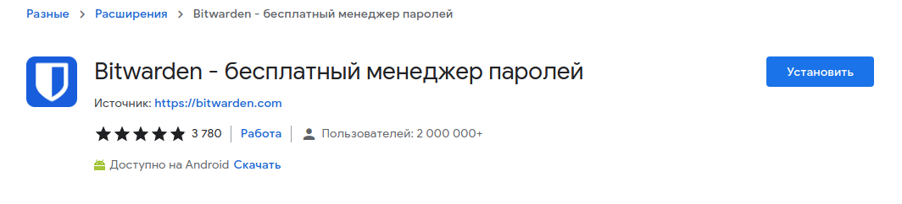
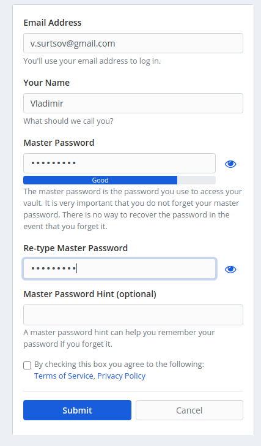
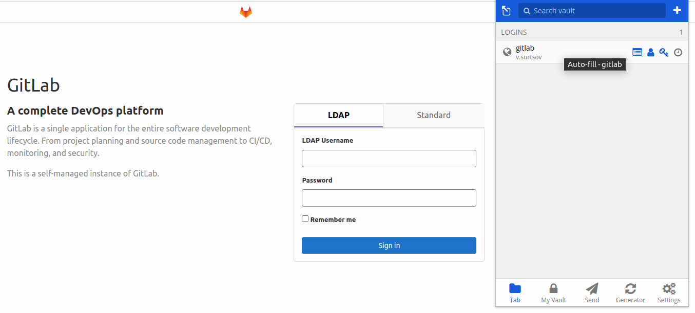
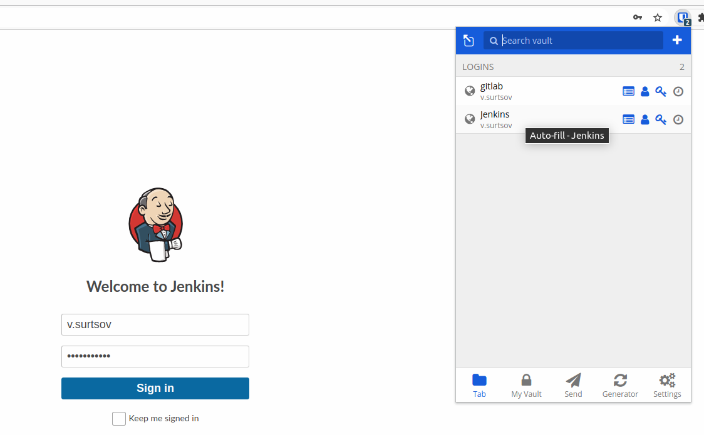
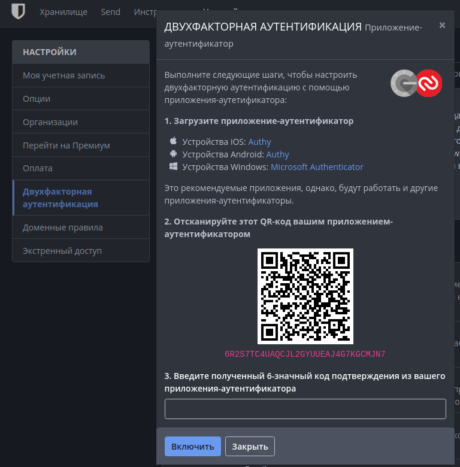
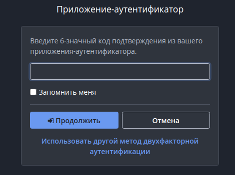
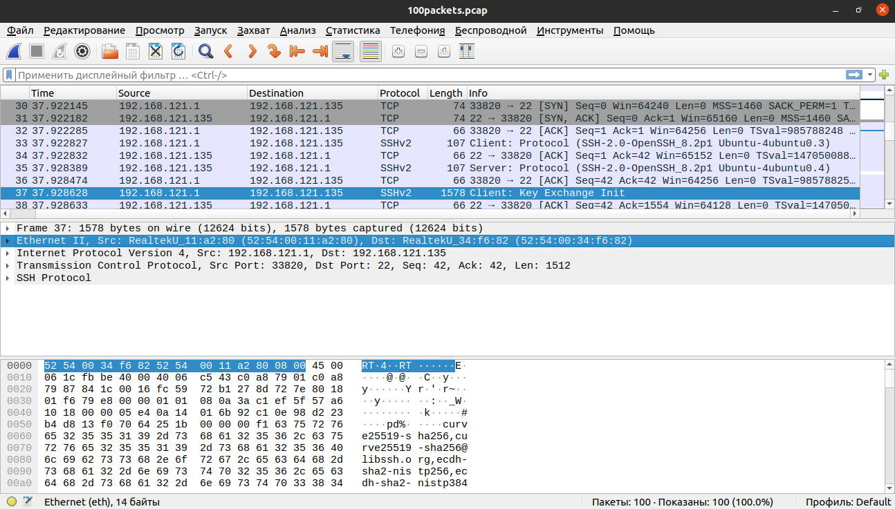

# devops-netology

## Домашнее задание к занятию "3.9. Элементы безопасности информационных систем"

### Установите Bitwarden плагин для браузера. Зарегестрируйтесь и сохраните несколько паролей.

1. Установка **Bitwarden** плагина для **Chromium** через магазин.



2. Регистрация на **Bitwarden**. 



3. Вход с помощью плагина в **GitLab**



4. Вход с плагином в **Jenkins**



### Установите Google authenticator на мобильный телефон. Настройте вход в Bitwarden акаунт через Google authenticator OTP.

1. Настройка **Google authenticator**



2. Вход с помощью **Google authenticator**



### Установите apache2, сгенерируйте самоподписанный сертификат, настройте тестовый сайт для работы по HTTPS.

1. Установка apache2 командой ```sudo apt-get install apache2```

2. Создаем ключ и сертефикат выполнив команду и ответив на все вопросы:
```
root@ubuntu2004:/home/vagrant# openssl req -x509 -nodes -days 365 -newkey rsa:2048 -keyout /etc/ssl/private/apache-selfsigned.key -out /etc/ssl/certs/apache-selfsigned.pem
Generating a RSA private key
................................+++++
...................................+++++
writing new private key to '/etc/ssl/private/apache-selfsigned.key'
-----
You are about to be asked to enter information that will be incorporated
into your certificate request.
What you are about to enter is what is called a Distinguished Name or a DN.
There are quite a few fields but you can leave some blank
For some fields there will be a default value,
If you enter '.', the field will be left blank.
-----
Country Name (2 letter code) [AU]:RU
State or Province Name (full name) [Some-State]:Saint-Petersburg
Locality Name (eg, city) []:Saint-Petersburg
Organization Name (eg, company) [Internet Widgits Pty Ltd]:Netology ltd
Organizational Unit Name (eg, section) []:devops
Common Name (e.g. server FQDN or YOUR name) []:Vladimir
Email Address []:v.surtsov@gmail.com
root@ubuntu2004:/home/vagrant# chmod 644 /etc/ssl/private/apache-selfsigned.key
root@ubuntu2004:/home/vagrant# chmod 644 /etc/ssl/certs/apache-selfsigned.pem
```
3. создаем конфиг в **sites-avaliable**:

```
root@ubuntu2004:/home/vagrant# cat /etc/apache2/sites-available/netology-ssl.conf 
<IfModule mod_ssl.c>
	<VirtualHost _default_:443>
		ServerAdmin v.surtsov@gmail.com 

		DocumentRoot /var/www/html

		ErrorLog ${APACHE_LOG_DIR}/error.log
		CustomLog ${APACHE_LOG_DIR}/access.log combined

		SSLEngine on

		SSLCertificateFile	/etc/ssl/certs/apache-selfsigned.pem
		SSLCertificateKeyFile /etc/ssl/private/apache-selfsigned.key

	</VirtualHost>
</IfModule>

# vim: syntax=apache ts=4 sw=4 sts=4 sr noet
```
4. делаем символиклинк в **sites-enable**:
```bash
ln -s /etc/apache2/sites-available/netology-ssl.conf /etc/apache2/sites-enabled/netology-ssl.conf
```
5. Активируем модуль ssl и перезапускаем apache2:
```
root@ubuntu2004:/home/vagrant# a2enmod ssl
Considering dependency setenvif for ssl:
Module setenvif already enabled
Considering dependency mime for ssl:
Module mime already enabled
Considering dependency socache_shmcb for ssl:
Enabling module socache_shmcb.
Enabling module ssl.
See /usr/share/doc/apache2/README.Debian.gz on how to configure SSL and create self-signed certificates.
To activate the new configuration, you need to run:
  systemctl restart apache2
root@ubuntu2004: systemctl restart apache2
root@ubuntu2004: systemctl status apache2
● apache2.service - The Apache HTTP Server
     Loaded: loaded (/lib/systemd/system/apache2.service; enabled; vendor preset: enabled)
     Active: active (running) since Mon 2022-01-24 19:11:13 UTC; 3min 54s ago
       Docs: https://httpd.apache.org/docs/2.4/
    Process: 14289 ExecStart=/usr/sbin/apachectl start (code=exited, status=0/SUCCESS)
   Main PID: 14303 (apache2)
      Tasks: 55 (limit: 1071)
     Memory: 5.9M
     CGroup: /system.slice/apache2.service
             ├─14303 /usr/sbin/apache2 -k start
             ├─14304 /usr/sbin/apache2 -k start
             └─14305 /usr/sbin/apache2 -k start

Jan 24 19:11:13 ubuntu2004.localdomain systemd[1]: Starting The Apache HTTP Server...
Jan 24 19:11:13 ubuntu2004.localdomain apachectl[14302]: AH00558: apache2: Could not reliably determine the server's fully qualified domain n>
Jan 24 19:11:13 ubuntu2004.localdomain systemd[1]: Started The Apache HTTP Server.
```
6. Проверяем сертефикат:
```
root@ubuntu2004:/home/vagrant# curl --insecure -v https://localhost:443
*   Trying 127.0.0.1:443...
* TCP_NODELAY set
* Connected to localhost (127.0.0.1) port 443 (#0)
* ALPN, offering h2
* ALPN, offering http/1.1
* successfully set certificate verify locations:
*   CAfile: /etc/ssl/certs/ca-certificates.crt
  CApath: /etc/ssl/certs
* TLSv1.3 (OUT), TLS handshake, Client hello (1):
* TLSv1.3 (IN), TLS handshake, Server hello (2):
* TLSv1.3 (IN), TLS handshake, Encrypted Extensions (8):
* TLSv1.3 (IN), TLS handshake, Certificate (11):
* TLSv1.3 (IN), TLS handshake, CERT verify (15):
* TLSv1.3 (IN), TLS handshake, Finished (20):
* TLSv1.3 (OUT), TLS change cipher, Change cipher spec (1):
* TLSv1.3 (OUT), TLS handshake, Finished (20):
* SSL connection using TLSv1.3 / TLS_AES_256_GCM_SHA384
* ALPN, server accepted to use http/1.1
* Server certificate:
*  subject: C=RU; ST=Saint-Petersburg; L=Saint-Petersburg; O=Netology ltd; OU=devops; CN=Vladimir; emailAddress=v.surtsov@gmail.com
*  start date: Jan 24 18:59:22 2022 GMT
*  expire date: Jan 24 18:59:22 2023 GMT
*  issuer: C=RU; ST=Saint-Petersburg; L=Saint-Petersburg; O=Netology ltd; OU=devops; CN=Vladimir; emailAddress=v.surtsov@gmail.com
*  SSL certificate verify result: self signed certificate (18), continuing anyway.
> GET / HTTP/1.1
> Host: localhost
> User-Agent: curl/7.68.0
> Accept: */*
> 
* TLSv1.3 (IN), TLS handshake, Newsession Ticket (4):
* TLSv1.3 (IN), TLS handshake, Newsession Ticket (4):
* old SSL session ID is stale, removing
* Mark bundle as not supporting multiuse
< HTTP/1.1 403 Forbidden
< Date: Mon, 24 Jan 2022 19:21:59 GMT
< Server: Apache/2.4.41 (Ubuntu)
< Content-Length: 275
< Content-Type: text/html; charset=iso-8859-1
< 
<!DOCTYPE HTML PUBLIC "-//IETF//DTD HTML 2.0//EN">
<html><head>
<title>403 Forbidden</title>
</head><body>
<h1>Forbidden</h1>
<p>You don't have permission to access this resource.</p>
<hr>
<address>Apache/2.4.41 (Ubuntu) Server at localhost Port 443</address>
</body></html>
* Connection #0 to host localhost left intact
```

### Проверьте на TLS уязвимости произвольный сайт в интернете (кроме сайтов МВД, ФСБ, МинОбр, НацБанк, РосКосмос, РосАтом, РосНАНО и любых госкомпаний, объектов КИИ, ВПК ... и тому подобное).

Проверяем ваш сайт...:
```
root@ubuntu2004:/home/vagrant/testssl.sh# ./testssl.sh -U --sneaky https://netology.ru

###########################################################
    testssl.sh       3.1dev from https://testssl.sh/dev/
    (93e3b49 2022-01-24 18:05:12 -- )

      This program is free software. Distribution and
             modification under GPLv2 permitted.
      USAGE w/o ANY WARRANTY. USE IT AT YOUR OWN RISK!

       Please file bugs @ https://testssl.sh/bugs/

###########################################################

 Using "OpenSSL 1.0.2-chacha (1.0.2k-dev)" [~183 ciphers]
 on ubuntu2004:./bin/openssl.Linux.x86_64
 (built: "Jan 18 17:12:17 2019", platform: "linux-x86_64")


Testing all IPv4 addresses (port 443): 104.22.40.171 172.67.21.207 104.22.41.171
----------------------------------------------------------------------------------------------
 Start 2022-01-24 19:33:23        -->> 104.22.40.171:443 (netology.ru) <<--

 Further IP addresses:   104.22.41.171 172.67.21.207 2606:4700:10::ac43:15cf 2606:4700:10::6816:28ab 2606:4700:10::6816:29ab 
 rDNS (104.22.40.171):   --
 Service detected:       HTTP


 Testing vulnerabilities 

 Heartbleed (CVE-2014-0160)                not vulnerable (OK), no heartbeat extension
 CCS (CVE-2014-0224)                       not vulnerable (OK)
 Ticketbleed (CVE-2016-9244), experiment.  not vulnerable (OK), no session tickets
 ROBOT                                     not vulnerable (OK)
 Secure Renegotiation (RFC 5746)           OpenSSL handshake didn't succeed
 Secure Client-Initiated Renegotiation     not vulnerable (OK)
 CRIME, TLS (CVE-2012-4929)                not vulnerable (OK)
 BREACH (CVE-2013-3587)                    potentially NOT ok, "gzip" HTTP compression detected. - only supplied "/" tested
                                           Can be ignored for static pages or if no secrets in the page
 POODLE, SSL (CVE-2014-3566)               not vulnerable (OK)
 TLS_FALLBACK_SCSV (RFC 7507)              Downgrade attack prevention supported (OK)
 SWEET32 (CVE-2016-2183, CVE-2016-6329)    VULNERABLE, uses 64 bit block ciphers
 FREAK (CVE-2015-0204)                     not vulnerable (OK)
 DROWN (CVE-2016-0800, CVE-2016-0703)      not vulnerable on this host and port (OK)
                                           make sure you don't use this certificate elsewhere with SSLv2 enabled services
                                           https://censys.io/ipv4?q=0E745E5E77A60345EB6E6B33B99A36286C2203D687F3377FBC685B2434518C53 could help you to find out
 LOGJAM (CVE-2015-4000), experimental      not vulnerable (OK): no DH EXPORT ciphers, no DH key detected with <= TLS 1.2
 BEAST (CVE-2011-3389)                     TLS1: ECDHE-RSA-AES128-SHA AES128-SHA ECDHE-RSA-AES256-SHA AES256-SHA DES-CBC3-SHA 
                                           VULNERABLE -- but also supports higher protocols  TLSv1.1 TLSv1.2 (likely mitigated)
 LUCKY13 (CVE-2013-0169), experimental     potentially VULNERABLE, uses cipher block chaining (CBC) ciphers with TLS. Check patches
 Winshock (CVE-2014-6321), experimental    not vulnerable (OK)
 RC4 (CVE-2013-2566, CVE-2015-2808)        no RC4 ciphers detected (OK)


 Done 2022-01-24 19:34:08 [  47s] -->> 104.22.40.171:443 (netology.ru) <<--

----------------------------------------------------------------------------------------------
 Start 2022-01-24 19:34:08        -->> 172.67.21.207:443 (netology.ru) <<--

 Further IP addresses:   104.22.41.171 104.22.40.171 2606:4700:10::ac43:15cf 2606:4700:10::6816:28ab 2606:4700:10::6816:29ab 
 rDNS (172.67.21.207):   --
 Service detected:       HTTP


 Testing vulnerabilities 

 Heartbleed (CVE-2014-0160)                not vulnerable (OK), no heartbeat extension
 CCS (CVE-2014-0224)                       not vulnerable (OK)
 Ticketbleed (CVE-2016-9244), experiment.  not vulnerable (OK), no session tickets
 ROBOT                                     not vulnerable (OK)
 Secure Renegotiation (RFC 5746)           OpenSSL handshake didn't succeed
 Secure Client-Initiated Renegotiation     not vulnerable (OK)
 CRIME, TLS (CVE-2012-4929)                not vulnerable (OK)
 BREACH (CVE-2013-3587)                    potentially NOT ok, "gzip" HTTP compression detected. - only supplied "/" tested
                                           Can be ignored for static pages or if no secrets in the page
 POODLE, SSL (CVE-2014-3566)               not vulnerable (OK)
 TLS_FALLBACK_SCSV (RFC 7507)              Downgrade attack prevention supported (OK)
 SWEET32 (CVE-2016-2183, CVE-2016-6329)    VULNERABLE, uses 64 bit block ciphers
 FREAK (CVE-2015-0204)                     not vulnerable (OK)
 DROWN (CVE-2016-0800, CVE-2016-0703)      not vulnerable on this host and port (OK)
                                           make sure you don't use this certificate elsewhere with SSLv2 enabled services
                                           https://censys.io/ipv4?q=0E745E5E77A60345EB6E6B33B99A36286C2203D687F3377FBC685B2434518C53 could help you to find out
 LOGJAM (CVE-2015-4000), experimental      not vulnerable (OK): no DH EXPORT ciphers, no DH key detected with <= TLS 1.2
 BEAST (CVE-2011-3389)                     TLS1: ECDHE-RSA-AES128-SHA AES128-SHA ECDHE-RSA-AES256-SHA AES256-SHA DES-CBC3-SHA 
                                           VULNERABLE -- but also supports higher protocols  TLSv1.1 TLSv1.2 (likely mitigated)
 LUCKY13 (CVE-2013-0169), experimental     potentially VULNERABLE, uses cipher block chaining (CBC) ciphers with TLS. Check patches
 Winshock (CVE-2014-6321), experimental    not vulnerable (OK)
 RC4 (CVE-2013-2566, CVE-2015-2808)        no RC4 ciphers detected (OK)


 Done 2022-01-24 19:34:43 [  82s] -->> 172.67.21.207:443 (netology.ru) <<--

----------------------------------------------------------------------------------------------
 Start 2022-01-24 19:34:43        -->> 104.22.41.171:443 (netology.ru) <<--

 Further IP addresses:   172.67.21.207 104.22.40.171 2606:4700:10::ac43:15cf 2606:4700:10::6816:28ab 2606:4700:10::6816:29ab 
 rDNS (104.22.41.171):   --
 Service detected:       HTTP


 Testing vulnerabilities 

 Heartbleed (CVE-2014-0160)                not vulnerable (OK), no heartbeat extension
 CCS (CVE-2014-0224)                       not vulnerable (OK)
 Ticketbleed (CVE-2016-9244), experiment.  not vulnerable (OK), no session tickets
 ROBOT                                     not vulnerable (OK)
 Secure Renegotiation (RFC 5746)           OpenSSL handshake didn't succeed
 Secure Client-Initiated Renegotiation     not vulnerable (OK)
 CRIME, TLS (CVE-2012-4929)                not vulnerable (OK)
 BREACH (CVE-2013-3587)                    potentially NOT ok, "gzip" HTTP compression detected. - only supplied "/" tested
                                           Can be ignored for static pages or if no secrets in the page
 POODLE, SSL (CVE-2014-3566)               not vulnerable (OK)
 TLS_FALLBACK_SCSV (RFC 7507)              Downgrade attack prevention supported (OK)
 SWEET32 (CVE-2016-2183, CVE-2016-6329)    VULNERABLE, uses 64 bit block ciphers
 FREAK (CVE-2015-0204)                     not vulnerable (OK)
 DROWN (CVE-2016-0800, CVE-2016-0703)      not vulnerable on this host and port (OK)
                                           make sure you don't use this certificate elsewhere with SSLv2 enabled services
                                           https://censys.io/ipv4?q=0E745E5E77A60345EB6E6B33B99A36286C2203D687F3377FBC685B2434518C53 could help you to find out
 LOGJAM (CVE-2015-4000), experimental      not vulnerable (OK): no DH EXPORT ciphers, no DH key detected with <= TLS 1.2
 BEAST (CVE-2011-3389)                     TLS1: ECDHE-RSA-AES128-SHA AES128-SHA ECDHE-RSA-AES256-SHA AES256-SHA DES-CBC3-SHA 
                                           VULNERABLE -- but also supports higher protocols  TLSv1.1 TLSv1.2 (likely mitigated)
 LUCKY13 (CVE-2013-0169), experimental     potentially VULNERABLE, uses cipher block chaining (CBC) ciphers with TLS. Check patches
 Winshock (CVE-2014-6321), experimental    not vulnerable (OK)
 RC4 (CVE-2013-2566, CVE-2015-2808)        no RC4 ciphers detected (OK)


 Done 2022-01-24 19:35:28 [ 127s] -->> 104.22.41.171:443 (netology.ru) <<--

----------------------------------------------------------------------------------------------
Done testing now all IP addresses (on port 443): 104.22.40.171 172.67.21.207 104.22.41.171

```
Вцелом все нормально

### Установите на Ubuntu ssh сервер, сгенерируйте новый приватный ключ. Скопируйте свой публичный ключ на другой сервер. Подключитесь к серверу по SSH-ключу.

1. устанавливаем сервер командой ```apt-get install -y openssh-server```

2. генерируем ключ:
```
root@ubuntu2004:/home/vagrant/testssl.sh# ssh-keygen
Generating public/private rsa key pair.
Enter file in which to save the key (/root/.ssh/id_rsa): 
Created directory '/root/.ssh'.
Enter passphrase (empty for no passphrase): 
Enter same passphrase again: 
Your identification has been saved in /root/.ssh/id_rsa
Your public key has been saved in /root/.ssh/id_rsa.pub
The key fingerprint is:
SHA256:gCtspIfUZ1DjAZRZbAta3I29m8JAjf0PzZ0uk02QBXM root@ubuntu2004.localdomain
The key's randomart image is:
+---[RSA 3072]----+
|  o+%=+  o+E     |
|  .OoOoo oo      |
| .=.+++ + o .    |
|.* .oo = o +     |
|o = +   S =      |
| o . o o = o     |
|      .   o      |
|                 |
|                 |
+----[SHA256]-----+
root@ubuntu2004:/home/vagrant/testssl.sh# 
```

3. Копируем ключ и подключаемся без пароля:
```
ssh-copy-id vladimir@192.168.14.69
/usr/bin/ssh-copy-id: INFO: Source of key(s) to be installed: "/root/.ssh/id_rsa.pub"
/usr/bin/ssh-copy-id: INFO: attempting to log in with the new key(s), to filter out any that are already installed
/usr/bin/ssh-copy-id: INFO: 1 key(s) remain to be installed -- if you are prompted now it is to install the new keys
vladimir@192.168.14.69's password: 

Number of key(s) added: 1

Now try logging into the machine, with:   "ssh 'vladimir@192.168.14.69'"
and check to make sure that only the key(s) you wanted were added.

root@ubuntu2004:/home/vagrant/testssl.sh# ssh vladimir@192.168.14.69
Welcome to Ubuntu 20.04.3 LTS (GNU/Linux 5.12.0-051200rc8-generic x86_64)

 * Documentation:  https://help.ubuntu.com
 * Management:     https://landscape.canonical.com
 * Support:        https://ubuntu.com/advantage

27 updates can be applied immediately.
To see these additional updates run: apt list --upgradable

*** System restart required ***
Last login: Mon Jan 24 22:42:38 2022 from 192.168.14.211
┌[vladimir☮ubuntu]-(~)
└> 
```

### Переименуйте файлы ключей из задания 5. Настройте файл конфигурации SSH клиента, так чтобы вход на удаленный сервер осуществлялся по имени сервера.

1. mv .ssh/id_rsa .ssh/id_rsa_netology
2. Настраиваем:
```
Host netology
  HostName 192.168.14.69
  User vladimir
  PreferredAuthentications publickey
  IdentityFile ~/.ssh/id_rsa_netology
```
3. Подключаемся:
```
root@ubuntu2004:~# ssh netology 
Welcome to Ubuntu 20.04.3 LTS (GNU/Linux 5.12.0-051200rc8-generic x86_64)

 * Documentation:  https://help.ubuntu.com
 * Management:     https://landscape.canonical.com
 * Support:        https://ubuntu.com/advantage

27 updates can be applied immediately.
To see these additional updates run: apt list --upgradable

*** System restart required ***
Last login: Mon Jan 24 22:43:12 2022 from 192.168.121.135
┌[vladimir☮ubuntu]-(~)
└> 
```

### Соберите дамп трафика утилитой tcpdump в формате pcap, 100 пакетов. Откройте файл pcap в Wireshark.

1. Сканируем:
```
tcpdump -c 100 -w 100packets.pcap
tcpdump: listening on eth0, link-type EN10MB (Ethernet), capture size 262144 bytes
100 packets captured
150 packets received by filter
0 packets dropped by kernel
```

Открываем:



## Необязательные задания

### Просканируйте хост scanme.nmap.org. Какие сервисы запущены?

1. Сканируем 
```
┌[kisa☮kisa-Lenovo-G40-30]-(~)
└> nmap scanme.nmap.org
Starting Nmap 7.80 ( https://nmap.org ) at 2022-01-24 23:17 MSK
Nmap scan report for scanme.nmap.org (45.33.32.156)
Host is up (0.17s latency).
Other addresses for scanme.nmap.org (not scanned): 2600:3c01::f03c:91ff:fe18:bb2f
Not shown: 992 closed ports
PORT      STATE    SERVICE
22/tcp    open     ssh
80/tcp    open     http
135/tcp   filtered msrpc
139/tcp   filtered netbios-ssn
445/tcp   filtered microsoft-ds
1723/tcp  filtered pptp
9929/tcp  open     nping-echo
31337/tcp open     Elite

Nmap done: 1 IP address (1 host up) scanned in 19.54 seconds
```
2. Сервисы запущены:
   - SSH сервер на 22 порту
   - Web сервер на 80 порту
   - nping-echo на 9929
   - неизвестный сервис на 31337

### Установите и настройте фаервол ufw на web-сервер из задания 3. Откройте доступ снаружи только к портам 22,80,443

```
ufw status verbose 
Status: active
Logging: on (low)
Default: deny (incoming), allow (outgoing), disabled (routed)
New profiles: skip

To                         Action      From
--                         ------      ----
22/tcp                     ALLOW IN    Anywhere                  
80/tcp                     ALLOW IN    Anywhere                  
443/tcp                    ALLOW IN    Anywhere                  
22/tcp (v6)                ALLOW IN    Anywhere (v6)             
80/tcp (v6)                ALLOW IN    Anywhere (v6)             
443/tcp (v6)               ALLOW IN    Anywhere (v6)
```