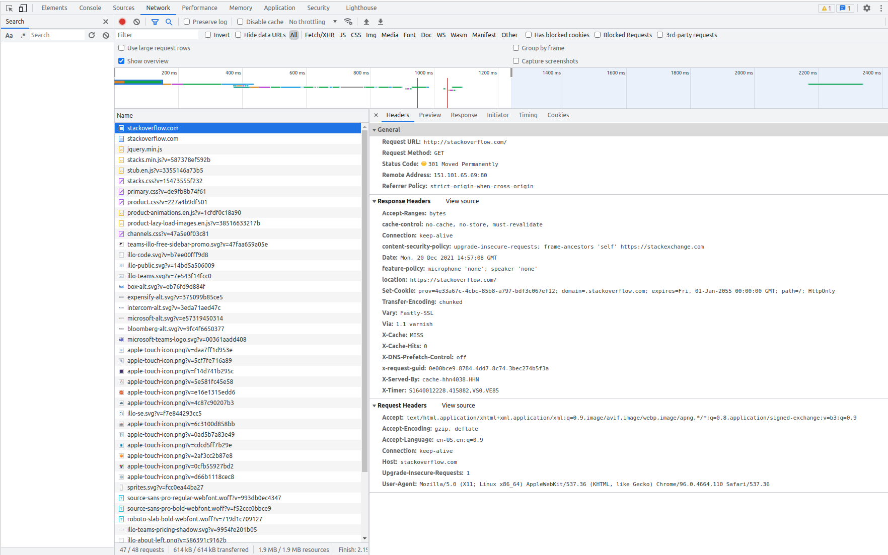
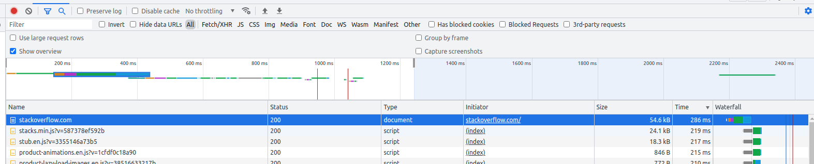
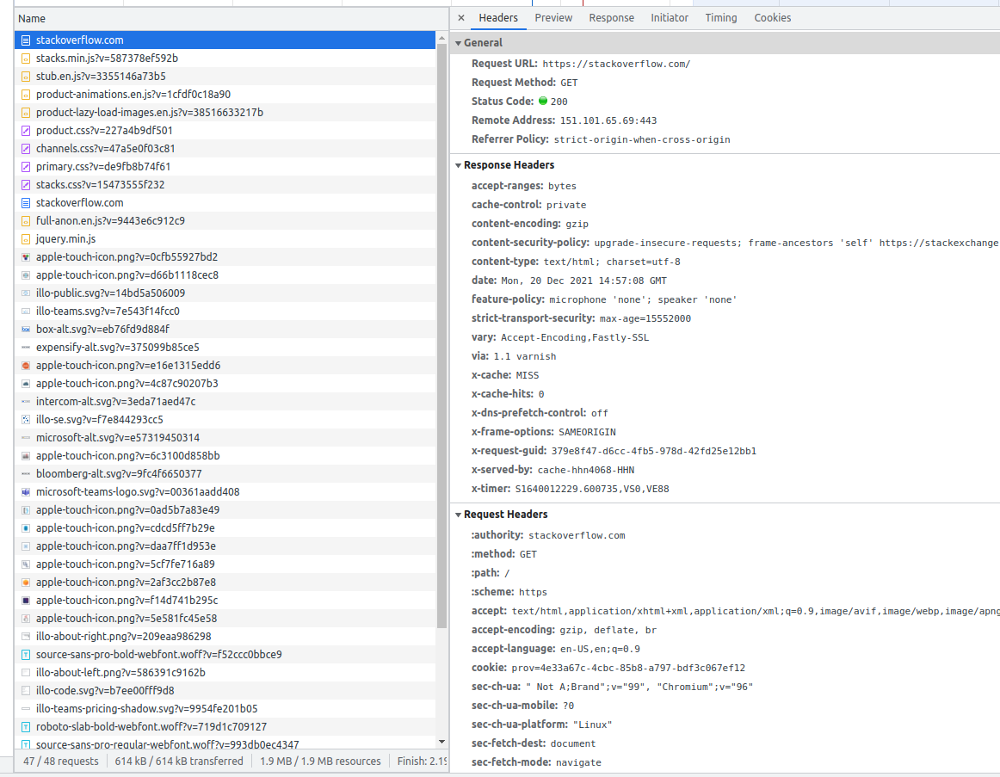
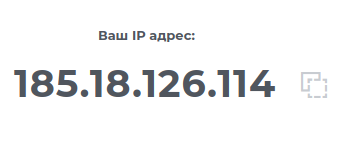

# devops-netology

## Домашнее задание к занятию "3.6. Компьютерные сети, лекция 1"

### Работа c HTTP через телнет.

Ответ:

```
Trying 151.101.129.69...
Connected to stackoverflow.com.
Escape character is '^]'.
GET /questions HTTP/1.0
HOST: stackoverflow.com

HTTP/1.1 301 Moved Permanently
cache-control: no-cache, no-store, must-revalidate
location: https://stackoverflow.com/questions
x-request-guid: a75fe95a-2e8c-49cd-8c57-d7bce5258cc4
feature-policy: microphone 'none'; speaker 'none'
content-security-policy: upgrade-insecure-requests; frame-ancestors 'self' https://stackexchange.com
Accept-Ranges: bytes
Date: Mon, 20 Dec 2021 14:49:18 GMT
Via: 1.1 varnish
Connection: close
X-Served-By: cache-hhn4053-HHN
X-Cache: MISS
X-Cache-Hits: 0
X-Timer: S1640011758.940911,VS0,VE170
Vary: Fastly-SSL
X-DNS-Prefetch-Control: off
Set-Cookie: prov=b7de11c7-6219-8320-4756-a40b2e9081dc; domain=.stackoverflow.com; expires=Fri, 01-Jan-2055 00:00:00 GMT; path=/; HttpOnly

Connection closed by foreign host.

```

Полученный HTTP код: ```301 Moved Permanently``` означает, что запрашиваемый ресурс перемещен на постоянной основе и текущие ссылки являются не актуальными. Перемещено с 80 порта на SSL 443 (https), о чем говорит ```location: https://stackoverflow.com/questions```.

### Повторите задание 1 в браузере, используя консоль разработчика F12.

#### Укажите в ответе полученный HTTP код/
```
301 Moved Permanently
```



#### Проверьте время загрузки страницы, какой запрос обрабатывался дольше всего?

Дольше всего выполнялся **GET** запрос ```https://stackoverflow.com/``` 





### Какой IP адрес у вас в интернете?

```zsh
┌[vladimir☮ubuntu]-(~/devops-netology)-[git://homework_3.6 ✗]-
└> wget -O - -q icanhazip.com
185.18.126.114
```
c 2ip:



### Какому провайдеру принадлежит ваш IP адрес? Какой автономной системе AS? Воспользуйтесь утилитой whois

- Провайдер: **Avantel**;
- AS: **AS51178**.

```
┌[vladimir☮ubuntu]-(~/devops-netology)-[git://homework_3.6 ✗]-
└> whois 185.18.126.114
% This is the RIPE Database query service.
% The objects are in RPSL format.
%
% The RIPE Database is subject to Terms and Conditions.
% See http://www.ripe.net/db/support/db-terms-conditions.pdf

% Note: this output has been filtered.
%       To receive output for a database update, use the "-B" flag.

% Information related to '185.18.126.0 - 185.18.127.255'

% Abuse contact for '185.18.126.0 - 185.18.127.255' is 'lir@avantel.ru'

inetnum:        185.18.126.0 - 185.18.127.255
netname:        Avantel-SPB
descr:          Avantel, St.Petersburg
country:        RU
language:       ru
geoloc:         59.930739279427 30.333479492187507
admin-c:        AVN812-RIPE
tech-c:         AVN812-RIPE
status:         ASSIGNED PA
mnt-by:         AVANTEL-MNT
mnt-by:         mnt-ru-avantelspb-1
mnt-by:         AVANTEL-SPB-MNT
mnt-lower:      AVANTEL-SPB-MNT
mnt-routes:     AVANTEL-SPB-MNT
created:        2015-07-13T06:43:20Z
last-modified:  2021-04-17T04:06:49Z
source:         RIPE

role:           Avantel St.Petersburg Branch Network Administrators
address:        JSC Avantel
address:        Beloostrovskaya st., n. 6, lit. A
address:        197342
address:        Saint Petersburg
address:        RUSSIAN FEDERATION
admin-c:        VB4043-RIPE
tech-c:         VB4043-RIPE
nic-hdl:        AVN812-RIPE
mnt-by:         AVANTEL-SPB-MNT
mnt-by:         mnt-ru-avantelspb-1
created:        2015-07-10T09:50:15Z
last-modified:  2021-04-17T03:54:25Z
source:         RIPE # Filtered

% Information related to '185.18.124.0/22AS51178'

route:          185.18.124.0/22
descr:          Avantel, St.Petersburg
origin:         AS51178
mnt-by:         AVANTEL-SPB-MNT
mnt-by:         mnt-ru-avantelspb-1
created:        2015-07-13T10:12:08Z
last-modified:  2021-04-16T08:02:56Z
source:         RIPE

% This query was served by the RIPE Database Query Service version 1.102.2 (HEREFORD)
```

### Через какие сети проходит пакет, отправленный с вашего компьютера на адрес 8.8.8.8? Через какие AS? Воспользуйтесь утилитой traceroute

| Узел           | Сеть            | AS      |
|:---------------|:---------------:| :------:|
| 185.18.126.113 | 185.18.126.0/22 | AS51178 |
| 188.68.187.227 | 188.68.186.0/23 | AS51178 |
| 72.14.212.134  | 72.14.192.0/18  |    -    |
| 74.125.37.218  | 74.125.0.0/16   |    -    |
| 74.125.244.181 | 74.125.0.0/16   |    -    |
| 72.14.232.85   | 72.14.192.0/18  |    -    |
| 142.250.208.25 | 142.250.0.0/15  | AS15169 |
| 172.253.79.237 | 172.253.0.0/16  | AS15169 |
| 8.8.8.8        | 8.8.8.0/24      |    -    |

```
traceroute to 8.8.8.8 (8.8.8.8), 30 hops max, 60 byte packets
 1  _gateway (192.168.10.1)  0.190 ms  0.170 ms  0.137 ms
 2  ae0-58.pirog17-cr1.spb.avantel.ru (185.18.126.113)  0.551 ms  0.522 ms  0.547 ms
 3  ae1.cvetoch19-cr1.spb.avantel.ru (188.68.187.227)  0.796 ms  0.814 ms  0.786 ms
 4  72.14.212.134 (72.14.212.134)  0.857 ms  0.829 ms  0.894 ms
 5  * * *
 6  74.125.37.218 (74.125.37.218)  0.888 ms 74.125.244.129 (74.125.244.129)  1.908 ms 216.239.59.142 (216.239.59.142)  0.944 ms
 7  74.125.244.181 (74.125.244.181)  2.610 ms 74.125.244.180 (74.125.244.180)  1.029 ms 74.125.244.133 (74.125.244.133)  2.919 ms
 8  72.14.232.85 (72.14.232.85)  10.866 ms 216.239.48.163 (216.239.48.163)  4.177 ms 142.251.61.221 (142.251.61.221)  5.431 ms
 9  142.250.208.25 (142.250.208.25)  6.208 ms 172.253.64.55 (172.253.64.55)  6.417 ms 142.251.61.221 (142.251.61.221)  5.517 ms
10  * 172.253.79.237 (172.253.79.237)  4.448 ms 216.239.49.107 (216.239.49.107)  5.495 ms
11  * * *
12  * * *
13  * * *
14  * * *
15  * * *
16  * * *
17  * * *
18  * * *
19  * * *
20  * dns.google (8.8.8.8)  4.460 ms  4.345 ms
```

### Повторите задание 5 в утилите mtr. На каком участке наибольшая задержка - delay?

Наибольшая средняя задержка на участке **72.14.232.85** и составляет **144.7мс**.

```
ubuntu (192.168.14.69)                                                  2021-12-20T19:01:18+0300
Keys:  Help   Display mode   Restart statistics   Order of fields   quit
                                                        Packets               Pings
 Host                                                 Loss%   Snt   Last   Avg  Best  Wrst StDev
 1. _gateway                                           0.0%   167    0.3   0.3   0.2   0.6   0.0
 2. ae0-58.pirog17-cr1.spb.avantel.ru                  0.0%   167   68.4   8.6   0.4  92.7  20.8
 3. ae1.cvetoch19-cr1.spb.avantel.ru                   0.0%   167   11.3   7.1   0.8  97.3  17.9
 4. 72.14.212.134                                      0.0%   167    0.9   1.0   0.9   1.4   0.1
 5. 172.253.76.91                                      0.0%   167    1.0   1.0   0.9   4.3   0.3
 6. 74.125.244.180                                     0.0%   167    1.2   2.2   1.0  28.0   3.3
 7. 72.14.232.85                                       0.0%   167    1.5   4.4   1.3 144.7  14.4
 8. 142.251.51.187                                     0.6%   167    5.0   7.6   4.7  57.0   8.5
 9. 172.253.79.237                                     0.0%   167    4.6   4.7   4.6   6.3   0.1
10. (waiting for reply)
11. (waiting for reply)
12. (waiting for reply)
13. (waiting for reply)
14. (waiting for reply)
15. (waiting for reply)
16. (waiting for reply)
17. (waiting for reply)
18. (waiting for reply)
19. (waiting for reply)
20. (waiting for reply)
21. dns.google                                         0.0%   167    4.5   4.5   4.4   4.8   0.1
```

### Какие DNS сервера отвечают за доменное имя dns.google? Какие A записи? воспользуйтесь утилитой dig

Сервера:

- 8.8.8.8

- 8.8.4.4

А записи:

```
dns.google.		367	IN	A	8.8.8.8
dns.google.		367	IN	A	8.8.4.4
```
Вывод dig

```
┌[vladimir☮ubuntu]-(~/devops-netology)-[git://homework_3.6 ✗]-
└> dig dns.google

; <<>> DiG 9.16.1-Ubuntu <<>> dns.google
;; global options: +cmd
;; Got answer:
;; ->>HEADER<<- opcode: QUERY, status: NOERROR, id: 37336
;; flags: qr rd ra; QUERY: 1, ANSWER: 2, AUTHORITY: 0, ADDITIONAL: 1

;; OPT PSEUDOSECTION:
; EDNS: version: 0, flags:; udp: 65494
;; QUESTION SECTION:
;dns.google.			IN	A

;; ANSWER SECTION:
dns.google.		367	IN	A	8.8.8.8
dns.google.		367	IN	A	8.8.4.4

;; Query time: 0 msec
;; SERVER: 127.0.0.53#53(127.0.0.53)
;; WHEN: Mon Dec 20 19:04:15 MSK 2021
;; MSG SIZE  rcvd: 71
```

### Проверьте PTR записи для IP адресов из задания 7. Какое доменное имя привязано к IP? воспользуйтесь утилитой dig

8.8.8.8 - dns.google.

8.8.4.4 - dns.google.

```
┌[vladimir☮ubuntu]-(~/devops-netology)-[git://homework_3.6 ✗]-
└> dig -x 8.8.8.8

; <<>> DiG 9.16.1-Ubuntu <<>> -x 8.8.8.8
;; global options: +cmd
;; Got answer:
;; ->>HEADER<<- opcode: QUERY, status: NOERROR, id: 27738
;; flags: qr rd ra; QUERY: 1, ANSWER: 1, AUTHORITY: 0, ADDITIONAL: 1

;; OPT PSEUDOSECTION:
; EDNS: version: 0, flags:; udp: 65494
;; QUESTION SECTION:
;8.8.8.8.in-addr.arpa.		IN	PTR

;; ANSWER SECTION:
8.8.8.8.in-addr.arpa.	4014	IN	PTR	dns.google.

;; Query time: 3 msec
;; SERVER: 127.0.0.53#53(127.0.0.53)
;; WHEN: Mon Dec 20 19:14:26 MSK 2021
;; MSG SIZE  rcvd: 73

┌[vladimir☮ubuntu]-(~/devops-netology)-[git://homework_3.6 ✗]-
└> dig -x 8.8.4.4

; <<>> DiG 9.16.1-Ubuntu <<>> -x 8.8.4.4
;; global options: +cmd
;; Got answer:
;; ->>HEADER<<- opcode: QUERY, status: NOERROR, id: 37668
;; flags: qr rd ra; QUERY: 1, ANSWER: 1, AUTHORITY: 0, ADDITIONAL: 1

;; OPT PSEUDOSECTION:
; EDNS: version: 0, flags:; udp: 65494
;; QUESTION SECTION:
;4.4.8.8.in-addr.arpa.		IN	PTR

;; ANSWER SECTION:
4.4.8.8.in-addr.arpa.	6945	IN	PTR	dns.google.

;; Query time: 0 msec
;; SERVER: 127.0.0.53#53(127.0.0.53)
;; WHEN: Mon Dec 20 19:14:52 MSK 2021
;; MSG SIZE  rcvd: 73
```


