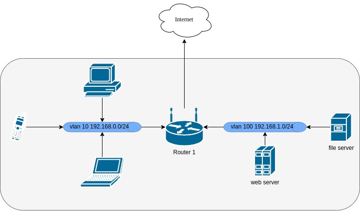

# devops-netology

## Домашнее задание к занятию "3.8. Компьютерные сети, лекция 3"

### Подключитесь к публичному маршрутизатору в интернет. Найдите маршрут к вашему публичному IP

```
route-views>show ip route 185.18.126.113
Routing entry for 185.18.124.0/22
  Known via "bgp 6447", distance 20, metric 0
  Tag 3356, type external
  Last update from 4.68.4.46 4w0d ago
  Routing Descriptor Blocks:
  * 4.68.4.46, from 4.68.4.46, 4w0d ago
      Route metric is 0, traffic share count is 1
      AS Hops 3
      Route tag 3356
      MPLS label: none
route-views>sh bg
route-views>sh bgp 185.18.236.84
BGP routing table entry for 185.18.236.0/22, version 1412169538
Paths: (22 available, best #10, table default)
  Not advertised to any peer
  Refresh Epoch 1
  3333 1103 8455 202796
    193.0.0.56 from 193.0.0.56 (193.0.0.56)
      Origin IGP, localpref 100, valid, external
      Community: 8455:1001 8455:1114 8455:2401 8455:5998 65000:8011
      path 7FE0A3BF16D0 RPKI State not found
      rx pathid: 0, tx pathid: 0
  Refresh Epoch 3
  3303 8455 202796
    217.192.89.50 from 217.192.89.50 (138.187.128.158)
      Origin IGP, localpref 100, valid, external
      Community: 3303:1004 3303:1006 3303:1030 3303:3051 8455:1001 8455:2401 8455:5998 65000:8011
      path 7FE08D051228 RPKI State not found
      rx pathid: 0, tx pathid: 0
  Refresh Epoch 1
  4901 6079 6939 57717 57717 51942 202796
    162.250.137.254 from 162.250.137.254 (162.250.137.254)
      Origin IGP, localpref 100, valid, external
      Community: 65000:10100 65000:10300 65000:10400
      path 7FE0BD3F3CC0 RPKI State not found
      rx pathid: 0, tx pathid: 0
  Refresh Epoch 1
  57866 9002 57717 57717 51942 202796
    37.139.139.17 from 37.139.139.17 (37.139.139.17)
      Origin IGP, metric 0, localpref 100, valid, external
      Community: 9002:0 9002:64657
      path 7FE1404FDE08 RPKI State not found
      rx pathid: 0, tx pathid: 0
  Refresh Epoch 1
  53767 6939 57717 57717 51942 202796
    162.251.163.2 from 162.251.163.2 (162.251.162.3)
      Origin IGP, localpref 100, valid, external
      Community: 53767:2000
      path 7FE151848A38 RPKI State not found
      rx pathid: 0, tx pathid: 0
  Refresh Epoch 1
  1351 6939 57717 57717 51942 202796
    132.198.255.253 from 132.198.255.253 (132.198.255.253)
      Origin IGP, localpref 100, valid, external
      path 7FE143BCFCC8 RPKI State not found
      rx pathid: 0, tx pathid: 0
  Refresh Epoch 1
  6939 57717 57717 51942 202796
    64.71.137.241 from 64.71.137.241 (216.218.252.164)
      Origin IGP, localpref 100, valid, external
      path 7FE0EE1894E8 RPKI State not found
      rx pathid: 0, tx pathid: 0
  Refresh Epoch 1
  20912 6939 57717 57717 51942 202796
    212.66.96.126 from 212.66.96.126 (212.66.96.126)
      Origin IGP, localpref 100, valid, external
      Community: 20912:65016
      path 7FE122980BA0 RPKI State not found
      rx pathid: 0, tx pathid: 0
  Refresh Epoch 2
  8283 42755 51942 202796
    94.142.247.3 from 94.142.247.3 (94.142.247.3)
      Origin IGP, metric 0, localpref 100, valid, external
      Community: 8283:1 8283:101
      unknown transitive attribute: flag 0xE0 type 0x20 length 0x18
        value 0000 205B 0000 0000 0000 0001 0000 205B
              0000 0005 0000 0001 
      path 7FE0AC42E8D8 RPKI State not found
      rx pathid: 0, tx pathid: 0
  Refresh Epoch 1
  3356 8455 202796
    4.68.4.46 from 4.68.4.46 (4.69.184.201)
      Origin IGP, metric 0, localpref 100, valid, external, best
      Community: 3356:2 3356:22 3356:100 3356:123 3356:503 3356:903 3356:2067 8455:1001 8455:1114 8455:2401 65000:8011
      path 7FE0484ADA60 RPKI State not found
      rx pathid: 0, tx pathid: 0x0
  Refresh Epoch 1
  101 6939 57717 57717 51942 202796
    209.124.176.223 from 209.124.176.223 (209.124.176.223)
      Origin IGP, localpref 100, valid, external
      Community: 101:20300 101:22100
      path 7FE03A2C0C80 RPKI State not found
      rx pathid: 0, tx pathid: 0
  Refresh Epoch 1
  852 6939 57717 57717 51942 202796
    154.11.12.212 from 154.11.12.212 (96.1.209.43)
      Origin IGP, metric 0, localpref 100, valid, external
      path 7FE10EE147A8 RPKI State not found
      rx pathid: 0, tx pathid: 0
  Refresh Epoch 1
  20130 23352 2914 8455 202796
    140.192.8.16 from 140.192.8.16 (140.192.8.16)
      Origin IGP, localpref 100, valid, external
      path 7FE15753E038 RPKI State not found
      rx pathid: 0, tx pathid: 0
  Refresh Epoch 1
  3549 3356 8455 202796
    208.51.134.254 from 208.51.134.254 (67.16.168.191)
      Origin IGP, metric 0, localpref 100, valid, external
      Community: 3356:2 3356:22 3356:100 3356:123 3356:503 3356:903 3356:2067 3549:2581 3549:30840 8455:1001 8455:1114 8455:2401
      path 7FE17219E828 RPKI State not found
      rx pathid: 0, tx pathid: 0
  Refresh Epoch 1
  2497 2914 8455 202796
    202.232.0.2 from 202.232.0.2 (58.138.96.254)
      Origin IGP, localpref 100, valid, external
      path 7FE164C61C50 RPKI State not found
      rx pathid: 0, tx pathid: 0
  Refresh Epoch 1
  7018 1299 8455 202796
    12.0.1.63 from 12.0.1.63 (12.0.1.63)
      Origin IGP, localpref 100, valid, external
      Community: 7018:5000 7018:37232
      path 7FE1208DCC70 RPKI State not found
      rx pathid: 0, tx pathid: 0
  Refresh Epoch 1
  49788 6939 57717 57717 51942 202796
    91.218.184.60 from 91.218.184.60 (91.218.184.60)
      Origin IGP, metric 0, localpref 100, valid, external
      Community: 49788:1000
      path 7FE13F303D70 RPKI State not found
      rx pathid: 0, tx pathid: 0
  Refresh Epoch 1
  1221 4637 8455 202796
    203.62.252.83 from 203.62.252.83 (203.62.252.83)
      Origin IGP, localpref 100, valid, external
      path 7FE054A86F20 RPKI State not found
      rx pathid: 0, tx pathid: 0
  Refresh Epoch 1
  701 3356 8455 202796
    137.39.3.55 from 137.39.3.55 (137.39.3.55)
      Origin IGP, localpref 100, valid, external
      path 7FE167970FF0 RPKI State not found
      rx pathid: 0, tx pathid: 0
  Refresh Epoch 1
  3257 33891 57717 57717 51942 202796
    89.149.178.10 from 89.149.178.10 (213.200.83.26)
      Origin IGP, metric 10, localpref 100, valid, external
      Community: 3257:4000 3257:8794 3257:50001 3257:50110 3257:54900 3257:54901 65535:65284
      path 7FE098790718 RPKI State not found
      rx pathid: 0, tx pathid: 0
  Refresh Epoch 1
  19214 174 42755 51942 202796
    208.74.64.40 from 208.74.64.40 (208.74.64.40)
      Origin IGP, localpref 100, valid, external
      Community: 174:21101 174:22010
      path 7FE0A0626660 RPKI State not found
      rx pathid: 0, tx pathid: 0
  Refresh Epoch 1
  3561 3910 3356 8455 202796
    206.24.210.80 from 206.24.210.80 (206.24.210.80)
      Origin IGP, localpref 100, valid, external
      path 7FE0569E7D38 RPKI State not found
      rx pathid: 0, tx pathid: 0
```

### Создайте dummy0 интерфейс в Ubuntu. Добавьте несколько статических маршрутов. Проверьте таблицу маршрутизации.

Создание dummy интерфейса:
```
vagrant@ubuntu2004:~$ sudo su
root@ubuntu2004:/home/vagrant# ip link add dummy0 type dummy
root@ubuntu2004:/home/vagrant# ip addr add 10.0.0.100/24 dev dummy0
root@ubuntu2004:/home/vagrant# ip link set up dummy0
root@ubuntu2004:/home/vagrant# ip a
1: lo: <LOOPBACK,UP,LOWER_UP> mtu 65536 qdisc noqueue state UNKNOWN group default qlen 1000
    link/loopback 00:00:00:00:00:00 brd 00:00:00:00:00:00
    inet 127.0.0.1/8 scope host lo
       valid_lft forever preferred_lft forever
2: eth0: <BROADCAST,MULTICAST,UP,LOWER_UP> mtu 1500 qdisc fq_codel state UP group default qlen 1000
    link/ether 52:54:00:34:f6:82 brd ff:ff:ff:ff:ff:ff
    inet 192.168.121.135/24 brd 192.168.121.255 scope global dynamic eth0
       valid_lft 3480sec preferred_lft 3480sec
    inet6 fe80::5054:ff:fe34:f682/64 scope link 
       valid_lft forever preferred_lft forever
3: dummy0: <BROADCAST,NOARP,UP,LOWER_UP> mtu 1500 qdisc noqueue state UNKNOWN group default qlen 1000
    link/ether 5a:f5:31:fa:4b:31 brd ff:ff:ff:ff:ff:ff
    inet 10.0.0.100/24 scope global dummy0
       valid_lft forever preferred_lft forever
```

Добавляем маршруты и проверяем:

```
:/home/vagrant# ip route 
default via 192.168.121.1 dev eth0 proto dhcp src 192.168.121.135 metric 100 
10.0.0.0/24 dev dummy0 proto kernel scope link src 10.0.0.100 
192.168.121.0/24 dev eth0 proto kernel scope link src 192.168.121.135 
192.168.121.1 dev eth0 proto dhcp scope link src 192.168.121.135 metric 100 
root@ubuntu2004:/home/vagrant# ip route add 10.10.10.0/24 via 10.0.0.1 dev dummy0
root@ubuntu2004:/home/vagrant# ip route add 10.10.0.0/24 via 10.0.0.1 dev dummy0 metric 10
root@ubuntu2004:/home/vagrant# ip route add 172.16.10.0/24 via 10.0.0.100 dev dummy0 metric 12
root@ubuntu2004:/home/vagrant# ip route add 0.0.0.0/0 via 10.0.0.250 dev dummy0 metric 100^C
root@ubuntu2004:/home/vagrant# ip route 
default via 192.168.121.1 dev eth0 proto dhcp src 192.168.121.135 metric 100 
10.0.0.0/24 dev dummy0 proto kernel scope link src 10.0.0.100 
10.10.0.0/24 via 10.0.0.1 dev dummy0 metric 10 
10.10.10.0/24 via 10.0.0.1 dev dummy0 
172.16.10.0/24 via 10.0.0.100 dev dummy0 metric 12 
192.168.121.0/24 dev eth0 proto kernel scope link src 192.168.121.135 
192.168.121.1 dev eth0 proto dhcp scope link src 192.168.121.135 metric 100 
root@ubuntu2004:/home/vagrant# ip route add 0.0.0.0/0 via 10.0.0.1 dev dummy0 metric 1
root@ubuntu2004:/home/vagrant# ip route 
default via 10.0.0.1 dev dummy0 metric 1 
default via 192.168.121.1 dev eth0 proto dhcp src 192.168.121.135 metric 100 
10.0.0.0/24 dev dummy0 proto kernel scope link src 10.0.0.100 
10.10.0.0/24 via 10.0.0.1 dev dummy0 metric 10 
10.10.10.0/24 via 10.0.0.1 dev dummy0 
172.16.10.0/24 via 10.0.0.100 dev dummy0 metric 12 
192.168.121.0/24 dev eth0 proto kernel scope link src 192.168.121.135 
192.168.121.1 dev eth0 proto dhcp scope link src 192.168.121.135 metric 100 
```

### Проверьте открытые TCP порты в Ubuntu, какие протоколы и приложения используют эти порты? Приведите несколько примеров.

Проверяем открытые порты:

```
netstat -tlpn
(Not all processes could be identified, non-owned process info
 will not be shown, you would have to be root to see it all.)
Active Internet connections (only servers)
Proto Recv-Q Send-Q Local Address           Foreign Address         State       PID/Program name    
tcp        0      0 127.0.0.1:19999         0.0.0.0:*               LISTEN      491133/ssh          
tcp        0      0 127.0.0.1:39743         0.0.0.0:*               LISTEN      42552/code          
tcp        0      0 0.0.0.0:42527           0.0.0.0:*               LISTEN      -                   
tcp        0      0 0.0.0.0:2049            0.0.0.0:*               LISTEN      -                   
tcp        0      0 0.0.0.0:40643           0.0.0.0:*               LISTEN      -                   
tcp        0      0 0.0.0.0:45891           0.0.0.0:*               LISTEN      -                   
tcp        0      0 127.0.0.1:43495         0.0.0.0:*               LISTEN      42587/code          
tcp        0      0 0.0.0.0:9000            0.0.0.0:*               LISTEN      -                   
tcp        0      0 127.0.0.1:5900          0.0.0.0:*               LISTEN      -                   
tcp        0      0 0.0.0.0:111             0.0.0.0:*               LISTEN      -                   
tcp        0      0 0.0.0.0:8080            0.0.0.0:*               LISTEN      -                   
tcp        0      0 172.28.128.1:53         0.0.0.0:*               LISTEN      -                   
tcp        0      0 192.168.121.1:53        0.0.0.0:*               LISTEN      -                   
tcp        0      0 127.0.0.53:53           0.0.0.0:*               LISTEN      -                   
tcp        0      0 192.168.140.1:53        0.0.0.0:*               LISTEN      -                   
tcp        0      0 192.168.130.1:53        0.0.0.0:*               LISTEN      -                   
tcp        0      0 192.168.125.1:53        0.0.0.0:*               LISTEN      -                   
tcp        0      0 10.0.0.1:53             0.0.0.0:*               LISTEN      -                   
tcp        0      0 0.0.0.0:22              0.0.0.0:*               LISTEN      -                   
tcp        0      0 127.0.0.1:631           0.0.0.0:*               LISTEN      -                   
tcp        0      0 0.0.0.0:37627           0.0.0.0:*               LISTEN      -                   
tcp6       0      0 ::1:19999               :::*                    LISTEN      491133/ssh          
tcp6       0      0 :::42943                :::*                    LISTEN      -                   
tcp6       0      0 :::2049                 :::*                    LISTEN      -                   
tcp6       0      0 :::41031                :::*                    LISTEN      -                   
tcp6       0      0 :::9000                 :::*                    LISTEN      -                   
tcp6       0      0 :::43115                :::*                    LISTEN      -                   
tcp6       0      0 :::45391                :::*                    LISTEN      42587/code          
tcp6       0      0 :::111                  :::*                    LISTEN      -                   
tcp6       0      0 ::1:3350                :::*                    LISTEN      -                   
tcp6       0      0 :::22                   :::*                    LISTEN      -                   
tcp6       0      0 ::1:631                 :::*                    LISTEN      -                   
tcp6       0      0 :::38811                :::*                    LISTEN      42552/code          
tcp6       0      0 :::42619                :::*                    LISTEN      -                   
tcp6       0      0 :::3389                 :::*                    LISTEN      -
```

- 9000 - проброс в контейнер
- 22 - SSH
- 8080 - WebServer nginx  http
- 53 - dns

### Проверьте используемые UDP сокеты в Ubuntu, какие протоколы и приложения используют эти порты?

Првоеряем

```
netstat -ulnp
(Not all processes could be identified, non-owned process info
 will not be shown, you would have to be root to see it all.)
Active Internet connections (only servers)
Proto Recv-Q Send-Q Local Address           Foreign Address         State       PID/Program name    
udp        0      0 0.0.0.0:631             0.0.0.0:*                           -                   
udp        0      0 0.0.0.0:2049            0.0.0.0:*                           -                   
udp        0      0 0.0.0.0:52865           0.0.0.0:*                           -                   
udp        0      0 224.0.0.251:5353        0.0.0.0:*                           3841/chrome --passw 
udp        0      0 224.0.0.251:5353        0.0.0.0:*                           3841/chrome --passw 
udp        0      0 224.0.0.251:5353        0.0.0.0:*                           3841/chrome --passw 
udp        0      0 224.0.0.251:5353        0.0.0.0:*                           3974/chrome --type= 
udp        0      0 0.0.0.0:5353            0.0.0.0:*                           -                   
udp        0      0 0.0.0.0:40085           0.0.0.0:*                           -                   
udp        0      0 0.0.0.0:57375           0.0.0.0:*                           -                   
udp        0      0 0.0.0.0:43157           0.0.0.0:*                           -                   
udp        0      0 0.0.0.0:47150           0.0.0.0:*                           -                   
udp        0      0 172.28.128.1:53         0.0.0.0:*                           -                   
udp        0      0 192.168.121.1:53        0.0.0.0:*                           -                   
udp        0      0 127.0.0.53:53           0.0.0.0:*                           -                   
udp        0      0 192.168.140.1:53        0.0.0.0:*                           -                   
udp        0      0 192.168.130.1:53        0.0.0.0:*                           -                   
udp        0      0 192.168.125.1:53        0.0.0.0:*                           -                   
udp        0      0 10.0.0.1:53             0.0.0.0:*                           -                   
udp        0      0 0.0.0.0:67              0.0.0.0:*                           -                   
udp        0      0 0.0.0.0:67              0.0.0.0:*                           -                   
udp        0      0 0.0.0.0:67              0.0.0.0:*                           -                   
udp        0      0 0.0.0.0:67              0.0.0.0:*                           -                   
udp        0      0 0.0.0.0:67              0.0.0.0:*                           -                   
udp        0      0 0.0.0.0:111             0.0.0.0:*                           -                   
udp6       0      0 :::2049                 :::*                                -                   
udp6       0      0 :::5353                 :::*                                -                   
udp6       0      0 :::40676                :::*                                -                   
udp6       0      0 :::59173                :::*                                -                   
udp6       0      0 :::45107                :::*                                -                   
udp6       0      0 :::48272                :::*                                -                   
udp6       0      0 :::48479                :::*                                -                   
udp6       0      0 :::111                  :::*                                -
```
- 53 - dns
- 111 - SunRPC (SUN Remote Procedure Call)
- 67 - DHCP
- 2049 - NFS

### Используя diagrams.net, создайте L3 диаграмму вашей домашней сети или любой другой сети, с которой вы работали.

Схема сети:

